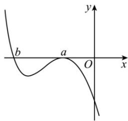
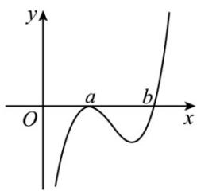
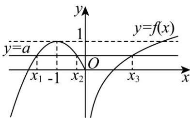

深圳中学 2024 级高二数学周测（7）参考答案

<table><tr><td>题号</td><td>1</td><td>2</td><td>3</td><td>4</td><td>5</td><td>6</td><td>7</td><td>8</td><td>9</td><td>10</td></tr><tr><td>答案</td><td>C</td><td>A</td><td>B</td><td>C</td><td>C</td><td>C</td><td>D</td><td>D</td><td>AC</td><td>ABC</td></tr><tr><td>题号</td><td>11</td><td>12</td><td>13</td><td>14</td><td></td><td></td><td></td><td></td><td></td><td></td></tr><tr><td>答案</td><td>ACD</td><td> $\frac{3}{20}$ </td><td> $(1,+\infty)$ </td><td> $[0,e)$ </td><td></td><td></td><td></td><td></td><td></td><td></td></tr></table>

5. C[详解]设曲线 $y = \ln x$ 的切点为 $(x_{1}, \ln x_{1})$ ，则由 $y' = \frac{1}{x}$ ，可得切线方程为

$y=\frac{1}{x_{1}}(x-x_{1})+\ln x_{1}=\frac{1}{x_{1}}x-1+\ln x_{1}$ ，因为切线过点 $(0,-2)$ ，所以 $-1+\ln x_{1}=-2$ ，解得 $x_{1}=\frac{1}{e}$

所以切线方程为 $y = \mathrm{e}x - 2$ ；设曲线 $y = \mathrm{e}^x - a$ 的切点为 $(x_2, \mathrm{e}^{x_2} - a)$ ，由 $y' = \mathrm{e}^x$ ，所以切线的斜率 $k = \mathrm{e}^{x_2}$ ，因为直线 $l$ 的方程为 $y = \mathrm{e}x - 2$ ，可得 $\mathrm{e}^{x_2} = \mathrm{e}$ ，解得 $x_2 = 1$ ，即切点为 $(1, \mathrm{e} - a)$ ，所以切线方程为 $y - (\mathrm{e} - a) = \mathrm{e}(x - 1)$ ，即 $y = \mathrm{e}x - a$ ，所以 $-a = -2$ ，解得 $a = 2$ 。

6. C[详解]设 $g(x)=\frac{f(x)}{\mathrm{e}^{x}}$ ，则 $g'(x)=\frac{f'(x)-f(x)}{\mathrm{e}^{x}}$ ，因为 $f(x)>f'(x)$ ，所以

$$
g ^ {\prime} (x) <   0
$$

$$
g (x)
$$

$$
f (x) + 2 0 2 6
$$

$f(0)+2026=0,\quad f(0)=-2026,\quad f(x)+2026\mathrm{e}^{x}<0$ ，即 $\frac{f(x)}{\mathrm{e}^{x}}<-2026$ ，即 $g(x)<g(0)$ ，故x>0。

7. D[详解]若 $a = b$ ，则 $f(x) = a(x - a)^3$ 为无极值点，不符合题意， $\therefore f(x)$ 有 $a$ 和 $b$ 两个不同零点，且在 $x = a$ 左右附近是不变号，在 $x = b$ 左右附近是变号的。依题意， $a$ 为函数 $f(x) = a(x - a)^2(x - b)$ 的极大值点， $\therefore$ 在 $x = a$ 左右附近都是小于零的。

当 $a < 0$ 时，由 $x > b$ ， $f(x) \leq 0$ ，画出 $f(x)$ 的图象如图左所示。由图可知 $b < a$ ， $a < 0$ ，故$ab > a^{2}$ . 当 a > 0 时，由 x > b 时， $f(x) > 0$ ，画出 $f(x)$ 的图象如图右所示. 由图可知 b > a，
a > 0, 故 $ab > a^{2}$ . 综上所述， $ab > a^{2}$ 成立.

8. D[详解]因为 $f(-x)=\mathrm{e}^{-x}-\mathrm{e}^{x}+\sin2x=-f(x)$ ， $f(0)=0$ ，所以 $f(x)$ 为奇函数.

$$
f ^ {\prime} (x) = \mathrm{e} ^ {x} + \mathrm{e} ^ {- x} - 2 \cos 2 x \geq 2 \sqrt {\mathrm{e} ^ {x} \cdot \mathrm{e} ^ {- x}} - 2 \cos 2 x = 2 - 2 \cos 2 x \geq 0
$$

当且仅当 $e^{x}=e^{-x}$ 即 x=0 时等号成立，所以 $f(x)$ 在 R 上单调递增.

由 $f(\ln x) + f(-ax) < 0$ ，所以 $f(\ln x) < -f(-ax) = f(ax)$ ，所以 $\ln x < ax$ .

对任意 $x \in [2, +\infty)$ ，由 $\ln x < ax$ ，得 $a > \frac{\ln x}{x}$ ，所以只需 $a > \left(\frac{\ln x}{x}\right)_{\max}$ 即可.

令 $g(x) = \frac{\ln x}{x}$ ，则 $g'(x) = \frac{1 - \ln x}{x^2}$ ，令 $g'(x) > 0 \Rightarrow 2 < x < \mathrm{e}, g'(x) < 0 \Rightarrow x > \mathrm{e}$ ，

所以 $g(x)$ 在 $(2, e)$ 上单调递增，在 $(e, +\infty)$ 上单调递减。所以 $g(x)_{\max} = g(e) = \frac{1}{e}$ ，所以 $a > \frac{1}{e}$ 。10. ABC[详解]由题意知：方盒的底面为边长为 4 - 2x 的正方形，高为 x，其中 0 < x < 2，则方盒的容积为 $V(x) = x(4 - 2x)^{2}(0 < x < 2)$ ，

$$
\therefore V ^ {\prime} (x) = (4 - 2 x) ^ {2} - 4 x (4 - 2 x) = (2 x - 4) (6 x - 4) = 4 (x - 2) (3 x - 2)
$$

则当 $x \in \left(0, \frac{2}{3}\right)$ 时， $V'(x) > 0$ ；当 $x \in \left(\frac{2}{3}, 2\right)$ 时， $V'(x) < 0$ ； $\therefore V(x)$ 在 $\left(0, \frac{2}{3}\right)$ 上单调递增，

在 $\left(\frac{2}{3},2\right)$ 上单调递减， $\therefore V(x)_{\max}=V\left(\frac{2}{3}\right)=\frac{128}{27}$ ，无最小值，ABC正确，D错误.

11. ACD[详解]选项B， $g'(x) = -x^2 + 1$ ，令 $g'(x) = 0$ ，得 $x = \pm 1$ ；

当 $x\in (-\infty , - 1)\cup (1, + \infty)$ 时， $g^{\prime}(x) <   0$ ，当 $x\in (-1,1)$ 时， $g^{\prime}(x) > 0$ ，所以 $g(x)$ 在 $(-1,1)$ 上单

调递增； $g(x)$ 在 $(- \infty, -1), (1, +\infty)$ 上单调递减； $g(x)$ 的极小值为 $g(-1) = -\frac{2}{3} + a$ ， $g(x)$ 的

极大值为 $g(1) = \frac{2}{3} + a$ ，要使 $g(x)$ 有三个零点，则 $\left\{ \begin{array}{l} g(-1) < 0 \\ g(1) > 0 \end{array} \right.$ ，解得 $-\frac{2}{3} < a < \frac{2}{3}$ ，故 B 错误.

选项 C, $F(x) = f(x) - g'(x) = m \ln x - x + x^{2} - 1$ ，则 $F'(x) = \frac{m}{x} + 2x - 1 = \frac{2x^{2} - x + m}{x}$

若 $F(x) = f(x) - g'(x)$ 有两个极值点，则 $2x^{2} - x + m = 0$ 在 $(0, +\infty)$ 有两个不同的正根，

则 $\Delta = 1 - 8m > 0$ 且 $x_{1} + x_{2} = \frac{1}{2} >0$ 且 $x_{1}x_{2} = \frac{m}{2} >0$ ，解得 $0 < m < \frac{1}{8}$ ，故C正确；

选项 D，令 $h(x)=f(mx)-\mathrm{e}^{x}+mx=m\ln mx-\mathrm{e}^{x}$ ，则 $m\ln mx \geq e^{x}$ ，所以 $\ln mx \geq \frac{1}{m}e^{x}$ ，

即 $\ln m + \ln x\geq \mathrm{e}^{\ln \frac{1}{m} +x}$ ，可整理为 $x + \ln x\geq \mathrm{e}^{x - \ln m} + x - \ln m$ 即 $\mathrm{e}^{\ln x} + \ln x\geq \mathrm{e}^{x - \ln m} + x - \ln m.$ 令

$g(x)=\mathrm{e}^{x}+x,\because g'(x)=\mathrm{e}^{x}+1>0$ ，所以 $g(x)$ 单调递增，所以 $\ln x\geq x-\ln m$ ，即

$\ln m\geq x-\ln x$ ，令 $p(x)=x-\ln x,\quad\therefore p'(x)=1-\frac{1}{x}=\frac{x-1}{x}$ ，当0<x<1时， $p'(x)<0$ ，当 $x>1_{时},\quad p'(x)>0,$

所以 $p(x)$ 在 $(0,1)$ 上单调递减，在 $(1, +\infty)$ 上单调递增，所以 $p(x)_{\min} = p(1) = 1$ ，即 $\ln m \geq 1$ ， $\therefore m \geq e$ ，所以 $m$ 的取值范围为 $[e, +\infty)$ ，所以 $D$ 正确。

12. $\frac{3}{20}$ [详解] $P(A\overline{B}\overline{C}) + P(\overline{A} B\overline{C}) + P(\overline{A}\overline{B} C) = \frac{3}{4}\times \frac{1}{3}\times \frac{1}{5} +\frac{1}{4}\times \frac{2}{3}\times \frac{1}{5} +\frac{1}{4}\times \frac{1}{3}\times \frac{4}{5} = \frac{3}{20}.$

13. $(1, +\infty)$ [详解]函数 $f(x)$ 在区间 $[1, 2]$ 上存在单调递减区间，即 $f'(x) = \ln x + 1 - \frac{a}{x} < 0$ 在 $x \in [1,2]$ 有解，即 $a > x\ln x + x$ 在 $x \in [1,2]$ 有解，设 $g(x) = x\ln x + x, x \in [1,2]$ ，可得 $g'(x) = \ln x + 2 > 0$ ，所以函数 $g(x)$ 在 $[1,2]$ 单调递增，所以 $g(x)_{\min} = g(1) = 1$ ，所以 $a > 1$ .

14. $[0, \mathbf{e})$ [详解]当 $x \leq 0$ 时， $f(x) = -x^2 - 2x = -(x + 1)^2 + 1$ ，为开口向下，对称轴为 $x = -1$ 的

抛物线，因为 $g(x) = f(x) - a$ 有三个零点 $x_{1}, x_{2}, x_{3}$ ，不妨令 $x_{1} < x_{2} < x_{3}$ ，

所以 $g(x) = f(x) - a = 0$ 有三个不相等的根 $x_{1}, x_{2}, x_{3}$ ，即 $y = f(x)$ 与 $y = a$ 图象有三个不同的

交点 $x_{1}, x_{2}, x_{3}$ ，作出图象，如图所示。所以 $0 \leq a < 1$ ，因为 $x_{1}, x_{2}$ 为方程 $-x^{2} - 2x = a$ ，

即 $x^{2} + 2x + a = 0$ 的两个不相等实根，所以 $x_{1}\cdot x_{2} = a$ 因为 $x_{3}$ 为方程 $\ln x = a$ 的根，所以 $x_{3} = \mathrm{e}^{a}$ 所以 $x_{1}\cdot x_{2}\cdot x_{3} = a\cdot \mathrm{e}^{a}$ .令 $h(x) = xe^{x},x\in [0,1)$

则 $h'(x) = \mathrm{e}^x + x\mathrm{e}^x = (1 + x)\mathrm{e}^x > 0$ ，所以 $h(x)$ 在 $[0,1)$ 上单调递增，所以 $h(0) \leq h(x) < h(1)$ ，即 $0 \leq h(x) < \mathrm{e}$ ，所以 $x_1 \cdot x_2 \cdot x_3 = a \cdot \mathrm{e}^a \in [0, \mathrm{e})$ 。

15.[详解]（1）当 $a = -1$ 时， $f(x) = \frac{x^2}{2} + \ln x + 2x + \frac{1}{2}$ ，所以 $f'(x) = x + \frac{1}{x} + 2$

所以 $f'(1)=1+\frac{1}{1}+2=4$ ，又 $f(1)=\frac{1^{2}}{2}+\ln 1+2\times 1+\frac{1}{2}=3$ ，

所以曲线 $y = f(x)$ 在点 $(1, f(1))$ 处的切线方程为 $y - 3 = 4(x - 1)$ ，即 4x - y - 1 = 0。

(2) 由 $f(x)=\frac{x^{2}}{2}-a\ln x-(a-1)x-\frac{a}{2}$ ,

得 $f'(x)=x-\frac{a}{x}-(a-1)=\frac{x^{2}-(a-1)x-a}{x}=\frac{(x-a)(x+1)}{x}$ ，函数 $f(x)$ 的定义域为 $(0,+\infty)$ ,

若 $a \leq 0$ ，可得 $x \in (0, +\infty)$ 时， $f'(x) > 0$ ，所以 $f(x)$ 在 $(0, +\infty)$ 上单调递增；

若 a > 0 时，当 $x \in (0, a)$ 时， $f'(x) < 0$ ，所以 $f(x)$ 在 $(0, a)$ 上单调递减；

当 $x \in (a, +\infty)$ 时， $f'(x) > 0$ ，所以 $f(x)$ 在 $(a, +\infty)$ 上单调递增；

综上所述：当 $a \leq 0$ 时， $f(x)$ 在 $(0, +\infty)$ 上单调递增；

当 $a > 0$ 时， $f(x)$ 在 $(0, a)$ 上单调递减，在 $(a, +\infty)$ 上单调递增.

（3）由（2）可知当 $a > 0$ 时， $f(x)$ 有极小值，

极小值为 $f(a) = \frac{a^2}{2} - a\ln a - (a - 1)a - \frac{a}{2} = -\frac{a^2}{2} - a\ln a + \frac{a}{2}$ ，此时极小值也是最小值，

由 $f(x) \geq 0$ ，可得 $-\frac{a^2}{2} - a \ln a + \frac{a}{2} \geq 0$ ， $\frac{a}{2} (1 - a - 2 \ln a) \geq 0$ ，又 $a > 0$ ，所以 $1 - a - 2 \ln a \geq 0$ .

令 $g(a)=1-a-2\ln a$ ，求导得 $g'(a)=-1-\frac{2}{a}<0$ ，

所以 $g(a)$ 在 $(0,+\infty)$ 上单调递减，又 $g(1)=1-1-2\ln1=0$

当 $a \in (0,1)$ 时， $g(a) > g(1) = 0$ ，当 $a \in (1, +\infty)$ 时， $g(a) < g(1) = 0$

所以 $a \in (0,1]$ 时， $g(a) \geq 0$ ，此时满足 $f(x) \geq 0$ ，所以 $a$ 的取值范围 $(0,1]$ .

16.[详解]（1）令 $g(x) = 0$ ，即 $\mathrm{e}^x -2a(x - 1) = 0$ ，则 $2a = \frac{\mathrm{e}^x}{x - 1}$

函数 $g(x)$ 在 $(1, +\infty)$ 上有零点等价于方程 $2a = \frac{\mathrm{e}^x}{x - 1}$ 在 $(1, +\infty)$ 上有解，

设 $h(x) = \frac{\mathrm{e}^x}{x - 1}$ ，则 $h'(x) = \frac{(x - 2)\mathrm{e}^x}{(x - 1)^2}$ ，故函数 $h(x)$ 在(1,2)上是减函数，在 $(2, +\infty)$ 上是增函数，

故 $h(x)\geq h(2) = \mathrm{e}^{2}$ ，所以 $a$ 的范围是 $\left[\frac{\mathrm{e}^2}{2}, + \infty\right)$

(2) 因为 $g(x)=\mathrm{e}^{x}-2a(x-1)$ ，故 $g'(x)=\mathrm{e}^{x}-2a$ ，

因为 a > 0 ，所以 $g'(x) = \mathrm{e}^{x} - 2a = 0$ 得 $x = \ln(2a)$ ,

故 $g(x)$ 在 $(- \infty, \ln(2a))$ 上是减函数，在 $(\ln(2a), +\infty)$ 上是增函数

因为 $x_{1} \neq x_{2}$ ， $g(x_{1}) = g(x_{2})$ ，所以不妨设 $x_{1} < \ln(2a)$ ， $x_{2} > \ln(2a)$ ，

$$
\text {设} F (x) = g (x) - g (2 \ln (2 a) - x) \quad (x > \ln (2 a)) = \mathrm{e} ^ {x} - 4 a ^ {2} \mathrm{e} ^ {- x} + 4 a \ln (2 a) - 4 a x,
$$

$$
F ^ {\prime} (x) = \mathrm{e} ^ {x} + 4 a ^ {2} \mathrm{e} ^ {- x} - 4 a \geq 2 \sqrt {\mathrm{e} ^ {x} \cdot 4 a ^ {2} \mathrm{e} ^ {- x}} - 4 a = 0, \tag {故}
$$

所以 $F(x)$ 在 $(\ln(2a), +\infty)$ 上是增函数，所以 $F(x) > F(\ln(2a))$ ，即 $F(x) > F(\ln(2a)) = 0$

$$
\text {故} ^ {g \left(x _ {2}\right) - g \left(2 \ln (2 a) - x _ {2}\right) > 0}, \text {即} ^ {g \left(x _ {2}\right) > g \left(2 \ln (2 a) - x _ {2}\right)},
$$

因为 $x_{1}<\ln(2a)$ ， $x_{2}>\ln(2a)$ ，且 $g(x_{1})=g(x_{2})$ ，

所以 $2\ln(2a)-x_{2}<\ln(2a)$ ，

因为 $g(x)$ 在 $(- \infty, \ln(2a))$ 上是减函数，所以 $x_1 < 2\ln(2a) - x_2$ ，故 $x_1 + x_2 < 2\ln(2a)$ .