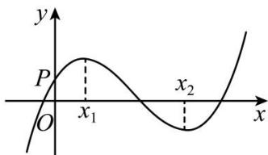

## 深圳中学 2024 级高二数学周测（8）

一、选择题：本题共8小题，每小题5分，共40分.在每小题给出的四个选项中，只有一个选项是正确的.
1. 已知离散型随机变量 X 的方差为 1，则 $D(2X+1)=(\quad)$ A.2 B. $\frac{1}{2}$ C.4 D. $\frac{1}{4}$

2. 设函数 $f(x) = \frac{\mathrm{e}^x}{x + a}$ . 若 $f'(1) = \frac{e}{4}$ ，则 $a = (\quad)$ . A.1 B.-1 C.-3+2√2 D.-3-2√2

3. 假设 A, B 是两个事件，且 $P(A) > 0$ ， $P(B) > 0$ ，则下列结论一定正确的是()
A. $P(B)=P(B|A)$ B. $P(AB)=P(A)P(B)$ C. $P(B|A)=P(A|B)$ D. $P(AB)\leq P(B|A)$

4. 现有两位游客慕名来江苏旅游,他们分别从太湖鼋头渚、苏州拙政园、镇江金山寺、中华恐龙园、南京夫子庙、扬州瘦西湖6个景点中随机选择1个景点游玩.记事件A为“两位游客中至少有一人选择太湖鼋头渚”,事件B为“两位游客选择的景点不同”,则 $P(B|A)=(\quad)$ A. $\frac{7}{9}$ B. $\frac{8}{9}$ C. $\frac{9}{11}$ D. $\frac{10}{11}$

5.已知曲线 $y = ae^{x} + x\ln x$ 在点(1,ae)处的切线方程为 $y = 2x + b$ ，则（）A. $a = e, b = -1$ B. $a = e, b = 1$ C. $a = e^{-1}, b = 1$ D. $a = e^{-1}, b = -1$

6. 长时间玩手机可能影响视力, 据调查, 某学校学生中, 大约有 $\frac{1}{5}$ 的学生每天玩手机超过 $1 \mathrm{~h}$ , 这些人近视率约为 $\frac{1}{2}$ , 其余学生的近视率约为 $\frac{3}{8}$ , 现从该校任意调查一名学生, 他近视的概率大约是 ( ) A. $\frac{1}{5}$ B. $\frac{7}{16}$ C. $\frac{2}{5}$ D. $\frac{7}{8}$

7. 函数 $f(x) = ax^3 + bx^2 + cx + d$ 的图象如图所示，则下列结论成立的是（）
A. $a > 0, b < 0, c > 0, d > 0$ B. $a > 0, b < 0, c < 0, d > 0$ C. $a < 0, b < 0, c > 0, d > 0$ D. $a > 0, b > 0, c > 0, d < 0$

8. 已知 $x = x_{1}$ 和 $x = x_{2}$ 分别是函数 $f(x) = 2a^{x} - \mathrm{e}x^{2}$ （ $a > 0$ 且 $a \neq 1$ ）的极小值点和极大值点。若 $x_{1} < x_{2}$ ，则 $a$ 的取值范围是（）A. $\left(0, \frac{1}{\mathrm{e}}\right)$ B. $\left(\frac{1}{\mathrm{e}}, 1\right)$ C. $(1, \mathrm{e})$ D. $(\mathrm{e}, +\infty)$

## 二、多选题：本题共3小题，每小题6分，共18分.在每小题给出的四个选项中，有多项符合题目要求.全部选对的得6分，部分选对的得部分分，选对但不全的得部分分，有选错的得0分.

9. 已知随机事件A，B满足 $P(A)=\frac{1}{2}$ ， $P(B)=\frac{1}{3}$ ， $P(\overline{A}|B)=P(\overline{A}|\overline{B})$ ，则（）
A. $P(\overline{A}\overline{B})=2P(\overline{A}B)$ B. $P(AB)=P(A)P(B)$ C. $P(\overline{A}|B)=\frac{1}{4}$ D. $P(A|B)=\frac{1}{3}$

10. 设函数 $f(x) = (x - 1)^2 (x - 4)$ ，则（）A. $x = 3$ 是 $f(x)$ 的极小值点 B. 当 $0 < x < 1$ 时， $f(x) < f(x^2)$ C. 当 $1 < x < 2$ 时， $-4 < f(2x - 1) < 0$ D. 当 $-1 < x < 0$ 时， $f(2 - x) > f(x)$

11.甲罐中有5个红球，2个白球和3个黑球，乙罐中有4个红球，3个白球和3个黑球.先从甲罐中随机取出一球放入乙罐，分别以 $A_{1}$ ， $A_{2}$ 和 $A_{3}$ 表示由甲罐取出的球是红球，白球和黑球的事件；再从乙罐中随机取出一球，以 $B$ 表示由乙罐取出的球是红球的事件，则下列结论中正确的是A. $P(B) = \frac{2}{5}$ B. $P(B|A_1) = \frac{5}{11}$ C.事件 $B$ 与事件 $A_{1}$ 相互独立 D. $A_{1}, A_{2}, A_{3}$ 是两两互斥的事件

## 三、填空题：3 小题，每小题 5 分，共 15 分.

12. 已知随机变量 X 的分布列为则期望 $D(X)=$ \_\_\_\_.

<table><tr><td>X</td><td>5</td><td>6</td><td>7</td></tr><tr><td>P</td><td>0.2</td><td>0.3</td><td>0.5</td></tr></table>

13. 已知函数 $f(x)=2\sin x+\sin 2x$ ，则 $f(x)$ 的最小值是 \_\_\_\_.

14. 设 $a \in (0,1)$ ，若函数 $f(x) = a^{x} + (1 + a)^{x}$ 在 $(0, +\infty)$ 上单调递增，则 a 的取值范围是 \_\_\_\_.

## 答题卡

班级\_\_\_\_ 姓名\_\_\_\_ 分数\_\_\_\_

<table><tr><td colspan="8">选择题</td><td colspan="3">多选题</td></tr><tr><td>1</td><td>2</td><td>3</td><td>4</td><td>5</td><td>6</td><td>7</td><td>8</td><td>9</td><td>10</td><td>11</td></tr><tr><td></td><td></td><td></td><td></td><td></td><td></td><td></td><td></td><td></td><td></td><td></td></tr></table>

12. \_\_\_\_ 13. \_\_\_\_ 14. \_\_\_\_

## 四、解答题：本题共2小题，共27分. 解答应写出必要的文字说明、证明过程或演算步骤.

15. 甲、乙两个学校进行体育比赛, 比赛共设三个项目, 每个项目胜方得 10 分, 负方得 0 分, 没有平局. 三个项目比赛结束后, 总得分高的学校获得冠军. 已知甲学校在三个项目中获胜的概率分别为 0.5, 0.4, 0.8, 各项目的比赛结果相互独立.

(1)求甲学校获得冠军的概率;

(2)用 X 表示乙学校的总得分,求 X 的分布列与期望.

16. 设函数 $f(x)=\ln(a-x)$ ，已知 x=0 是函数 $y=xf(x)$ 的极值点.

(1) 求 a;

（2）设函数 $g(x)=\frac{x+f(x)}{xf(x)}$ 。证明: $g(x)<1$

补充题：甲、乙两人投篮,每次由其中一人投篮,规则如下:若命中则此人继续投篮,若未命中则换为对方投篮.无论之前投篮情况如何,甲每次投篮的命中率均为0.6,乙每次投篮的命中率均为0.8,由抽签确定第1次投篮的人选,第1次投篮的人是甲、乙的概率各为0.5.

(1)求第2次投篮的人是乙的概率;

(2)求第 i 次投篮的人是甲的概率;

(3)已知:若随机变量 $X_{i}$ 服从两点分布,且 $P(X_{i}=1)=1-P(X_{i}=0)=q_{i}, i=1,2,\cdots,n$ , 则 $E(\sum_{i=1}^{n}X_{i})=\sum_{i=1}^{n}q_{i}$ . 记前 n 次(即从第 1 次到第 n 次投篮)中甲投篮的次数为 Y, 求 $E(Y)$ .