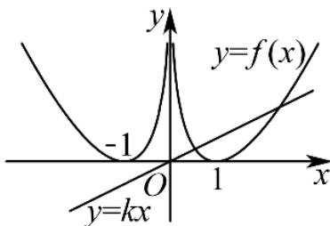
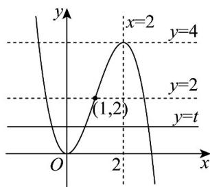

《深圳中学2024级高二数学周测（9）》参考答案1-8 BDADBCDB 9. ABC 10. AC 11. BCD 12. e 13. $\frac{23}{9}$ 14. $\frac{12}{625}$ , 6

1. B[详解]从 $^{10}$ 个零件中随机抽取 $^{3}$ 个，总的抽取方法数为组合数 $C_{10}^{3}$ ，要求恰好 $^{1}$ 件不合格，即从4个不合格零件中抽1个，从6个合格零件中抽2个，符合条件的方法数为 $C_{4}^{1}C_{6}^{2}$ ，故恰好1件不合格的概率为 $\frac{C_{4}^{1}C_{6}^{2}}{C_{10}^{3}}$ 。故选：B.

2. D[详解]由题意可得 $a + 2a + 3a = 1$ ，解得 $a = \frac{1}{6}$ ，所以 $P(X \geq 2) = P(X = 2) + P(X = 3) = 2a + 3a = \frac{5}{6}$ . 故选：D.

3. A[详解]由题可得 $f'(x)=3x^{2}-6x=3x(x-2)$ ，令 $f'(x)=0$ ，解得：x=0 或 x=2，
当 x<0 或 x>2 时， $f'(x)>0$ ，当 0<x<2 时， $f'(x)<0$ ，所以 $f(x)$ 的单调递增区间为： $(-∞,0)$ 和 $(2,+∞)$ ，单调递减区间为 $(0,2)$ ，所以 $f(x)$ 的极大值为 $f(0)=0$ ，极小值为 $f(2)=-4$ ，则函数 $f(x)=x^{3}-3x^{2}$ 的所有极值的和为 -4．故选：A.

4. D[详解]设甲获胜为事件A，甲第一局获胜为事件B，则

$$
P (A) = \frac {2}{3} \times \frac {2}{3} + \frac {2}{3} \times \frac {1}{3} \times \frac {2}{3} + \frac {1}{3} \times \frac {2}{3} \times \frac {2}{3} = \frac {2 0}{2 7}, P (A B) = \frac {2}{3} \times \frac {2}{3} + \frac {2}{3} \times \frac {1}{3} \times \frac {2}{3} = \frac {1 6}{2 7},
$$

所以在甲获胜的条件下，甲第一局获胜的概率是 $P(B|A) = \frac{P(AB)}{P(A)} = \frac{\frac{16}{27}}{\frac{20}{27}} = \frac{4}{5}$ . 故选：D.

5. B[详解]方法一：依题意，当 $X > 0$ 时， $X$ 的可能取值为1,3,5，所以

$$
P (X > 0) = P (X = 5) + P (X = 3) + P (X = 1) = \left(\frac {1}{3}\right) ^ {5} + C _ {5} ^ {1} \left(\frac {1}{3}\right) ^ {4} \left(\frac {2}{3}\right) + C _ {5} ^ {2} \left(\frac {1}{3}\right) ^ {3} \left(\frac {2}{3}\right) ^ {2} = \frac {1 7}{8 1}.
$$

方法二：设5次移动中向右移动的次数为 $Y$ ，则 $Y\sim B\left(5,\frac{1}{3}\right)$ ，则

$$
P (X > 0) = P (Y = 5) + P (Y = 4) + P (Y = 3) = \dots)
$$

6. C[详解]由题意可得： $0 < a < 1$ 。因为若 $a > 1$ ，当 $x \to 0+$ 时， $\log_{a} x \to -\infty$ ， $8^{x} > 0$ ，

则 $8^{x} \leq \frac{3}{2} + \log_{a} x$ 不能恒成立. 当 $0 < a < 1$ 时, $8^{x}$ 单调递增, $\log_{a} x$ 单调递减, 要使

$8^{x} \leq \frac{3}{2} + \log_{a} x$ 在 $x \in \left(0, \frac{1}{3}\right]$ 上恒成立，只需要 $8^{\frac{1}{3}} \leq \frac{3}{2} + \log_{a} \frac{1}{3} \Rightarrow \log_{a} \frac{1}{3} \geq \frac{1}{2} = \log_{a} a^{\frac{1}{2}} \Rightarrow a^{\frac{1}{2}} \geq \frac{1}{3}$

$\Rightarrow a \geq \frac{1}{9}$ ，所以实数 $a$ 的取值范围为： $\frac{1}{9} \leq a < 1$ 。故选：C

7. D[详解]方法一：设 $Y$ 为正面向上的次数，则 $Y \sim B\left(8, \frac{1}{2}\right)$ ，总得分

$X=2Y+(-1)\times(8-Y)=3Y-8$ ，由于 $E(Y)=8\times\frac{1}{2}=4$ ， $D(Y)=8\times\frac{1}{2}\times\left(1-\frac{1}{2}\right)=2$ ，所以

$E(X)=E(3Y-8)=3E(Y)-8=4$ , $D(X)=D(3Y-8)=9D(Y)=9\times2=18$ , 故选: D.

方法二：记第i次抛掷硬币的得分为随机变量 $X_{i}(i=1,2,\cdots,8)$ ，故 $X_{i}$ 的可能取值为2,-1，且

$P(X_{i} = 2) = P(X_{i} = -1) = \frac{1}{2}$ , 所以 $E(X_{i}) = 2 \times \frac{1}{2} + (-1) \times \frac{1}{2} = \frac{1}{2}$ ,

$$
E \left(X _ {i} ^ {2}\right) = 2 ^ {2} \times \frac {1}{2} + (- 1) ^ {2} \times \frac {1}{2} = \frac {5}{2}, \text {则} D \left(X _ {i}\right) = E \left(X _ {i} ^ {2}\right) - E ^ {2} \left(X _ {i}\right) = \frac {9}{4}.
$$

由题意可知： $X=X_{1}+X_{2}+\cdots X_{8}$ ，则 $E(X)=E(X_{1})+E(X_{2})+\cdots E(X_{8})=8\times\frac{1}{2}=4$

因为 $X_{1},X_{2},\cdots,X_{8}$ 之间相互独立，则 $D(X)=D(X_{1})+D(X_{2})+\cdots D(X_{8})=8\times\frac{9}{4}=18$

8. B[详解]由 $\frac{f'(x)}{2x - 3} >0$ 得，当 $x > \frac{3}{2}$ 时， $f'(x) > 0$ ，当 $x < \frac{3}{2}$ 时， $f'(x) < 0$ ，所以 $f(x)$

在 $\left(-\infty,\frac{3}{2}\right)$ 单调递减，在 $\left(\frac{3}{2},+\infty\right)$ 单调递增．又 $f\left(x+\frac{3}{2}\right)$ 是偶函数，所以直线 $x=\frac{3}{2}$ 为 $f(x)$ 的
对称轴，故 $f(0.2^{3})=f(3-0.2^{3})=f(2.992)$ . 因为 $\frac{3}{2}=\log_{2}2\sqrt{2}<\log_{2}3<2<2.992$ ，且 $f(x)$ 在 $\left(\frac{3}{2},+\infty\right)$ 单调递增，所以 $f(\log_{2}3)<f(2)<f(2.992)$ ，故b<c<a．故选：B.

9. ABC[详解]对于选项A，有放回抽取时，显然 $P(A) = P(B) = \frac{1}{3}$ ，故A正确．对于选项

B，不放回抽取时， $P(A)=\frac{1}{3}$ ， $P(B)=\frac{2}{3}\times\frac{1}{2}=\frac{1}{3}$ ，故 B 正确。对于选项 C，有放回抽取时，

因为事件 $A, B$ 相互独立， $P(B) = P(B|A)$ ，故C正确。对于选项D，不放回抽取时，若甲中奖，则乙一定不中奖，所以 $P(B|A) = 0 \neq P(B)$ ，故D错误。

10. AC[详解]对于选项A，由题设 $f(1) = (1 - 1)\ln 1 = 0$ ，A正确.

对于选项B，因为 $f(x)$ 为偶函数，若 $x < 0$ ，则 $-x > 0$ ，故

$f(x)=f(-x)=(-x-1)\ln(-x)=-(x+1)\ln(-x)$ ，B错误.

对于选项C，当 $x < 0$ 时， $f(x) = -(x + 1)\ln (-x)$ ，则 $f'(x) = -\ln (-x) - \frac{1}{x} - 1$ ，令

$g(x)=f'(x)\Rightarrow g'(x)=\frac{1}{x^{2}}-\frac{1}{x}=\frac{1-x}{x^{2}}>0$ ，即 $g(x)=f'(x)$ 在 $(-∞,0)$ 上单调递增，又 $f'(-1)=-\ln1+1-1=0$ ，故当 $x\in(-∞,-1)$ 时 $f'(x)<0$ ， $f(x)$ 在 $(-∞,-1)$ 上单调递减；当 $x\in(-1,0)$ 时 $f'(x)>0$ ， $f(x)$ 在 $(-1,0)$ 上单调递增，故x=-1是 $f(x)$ 的极小值点，C正确.
对于D选项，由C分析， $x\to-\infty$ 或 $x\to0^{-}$ 时 $f(x)\to+\infty$ ，且 $f(-1)=0$ ，所以在 $(-∞,-1)$

$(-1,0)$ 上 $f(x)\in (0, + \infty)$ ，又 $f(x)$ 为偶函数，故在 $(0,1)$ 、 $(1, + \infty)$ 上 $f(x)\in (0, + \infty)$ ，由图像可

知，直线 $y = kx$ 与 $y = f(x)$ 的图象恒有2个交点，D错误.故选：AC

11. BCD[详解]由题可得方程 $t = x^{2}(3 - x)$ （ $t \in R$ ）有三个不同的根
a、b、c，其中 a < b < c，则直线 y = t 与函数 $g(x) = x^{2}(3 - x)$ 图像有
三个不同的交点， $g'(x)=6x-3x^{2}=3x(2-x)$ ，则 $x\in(-\infty,0)\cup(2,+\infty)$

时 $g^{\prime}(x) < 0$ ， $x\in (0,2)$ 时 $g^{\prime}(x) > 0$ ，所以函数 $g(x)$ 在 $(0,2)$ 上单调递增，在 $(- \infty ,0),(2, + \infty)$ 上单调递减；且 $g(0) = 0,g(2) = 4,x\to -\infty$ 时 $g(x)\rightarrow +\infty$ ， $x\to +\infty$ 时 $g(x)\rightarrow -\infty$ ，作出函数 $g(x)$ 图像如图所示.

对于选项 A，由图可知 $t^{\prime}$ 的取值范围为 $(0,4)$ ，故 A 错误；

$$
t = x ^ {2} (3 - x)
$$

$$
x ^ {3} - 3 x ^ {2} + t = 0
$$

$$
a \text {、} b \text {、} c
$$

故 $x^{3} - 3x^{2} + t = (x - a)(x - b)(x - c) = x^{3} - (a + b + c)x^{2} + (ab + ac + bc)x - abc = 0$ ，所以

$a+b+c=3,ab+ac+bc=0,abc=-t$ ．因为 $ab+bc+ac=0$ ，所以

$\frac{1}{a} + \frac{1}{b} + \frac{1}{c} = \frac{ab + bc + ac}{abc} = 0$ ，故B正确；因为 $a + b + c = 3$ ，则 $a + b = 3 - c$ ，由图可知 $2 < c < 3$ ，所以 $a + b = 3 - c \in (0,1)$ ，故C正确；若 $a, b, c$ 成等差数列，则 $a + b + c = 3b = 3$ ，解得 $b = 1$ ，故 $f(b) = f(1) = 2 - t = 0$ ，则 $t = 2$ 当 $t = 2$ 时，$x^{3} - 3x^{2} + 2 = (x - 1)(x^{2} - 2x - 2) = 0$ ，故 $a$ 和 $c$ 是方程 $x^{2} - 2x - 2 = 0$ 的两根，故

$a+c=2=2b,\quad a,\quad b,\quad c$ 成等差数列，所以 D 正确；故选：BCD.

注：针对于 D 选项，对于任意的三次函数都有类似结论：

已知 $f(x)=ax^{3}+bx^{2}+cx+d(a\neq0)$ ，方程 $f(x)=t$ 有三个不同的实根

$x_{1}, x_{2}, x_{3} (x_{1} < x_{2} < x_{3})$ . 若 $x_{1}, x_{2}, x_{3}$ 构成等差数列，则必有 $x_{2} = -\frac{b}{3a}, t = f(x_{2}) = f\left(-\frac{b}{3a}\right)$ .

12. e[详解]当 $a \leq 0$ 时， $f(a) = e^{a} = e$ ，解得 a = 1，不符合题意；

当 $x > 0$ 时， $f(x) = x \ln x$ ，则 $f'(x) = \ln x + 1$ ，令 $f'(x) < 0 \Rightarrow 0 < x < \frac{1}{\mathrm{e}}, f'(x) > 0 \Rightarrow x > \frac{1}{\mathrm{e}}$

所以 $f(x)$ 在 $(0, \frac{1}{\mathrm{e}})$ 上单调递减，在 $(\frac{1}{\mathrm{e}}, +\infty)$ 上单调递增，且 $f(\frac{1}{\mathrm{e}}) = -\frac{1}{\mathrm{e}} < 0$ ，当 $x \to 0$ 时，

$\ln x \to -\infty$ ，则 $f(x) \to 0$ ，当 $x \to +\infty$ 时， $f(x) \to +\infty$ ，且 $0 < x < 1$ 时， $f(x) < 0$ ； $x > 1$ 时，

$f(x) > 0$ ；所以 $f(x)$ 在 $(0, +\infty)$ 上有且仅有唯一的零点。所以当时， $f(a) = a \ln a = e$ ，则 $a > 1$ ，解得 $a = e$ 。综上， $a = e$ 。故答案为： $e$

13. $\frac{23}{9}$ [详解]由题设 $X$ 可取0,2,4，又 $P(X = 0) = \frac{2}{6} \times \frac{1}{6} = \frac{1}{18}$ ，

$$
P (X = 2) = \frac {2}{6} \times \frac {5}{6} + \frac {4}{6} \times \frac {3}{6} = \frac {2 2}{3 6} = \frac {1 1}{1 8}, P (X = 4) = \frac {4}{6} \times \frac {3}{6} = \frac {6}{1 8} = \frac {1}{3},
$$

所以 $E(X)=0\times\frac{1}{18}+2\times\frac{11}{18}+4\times\frac{1}{3}=\frac{23}{9}$ .

思考：如果操作 $n$ 次，记袋中的白球个数为 $X_{n}$ ，则 $X_{n}$ 的数学期望是多少呢？

14. $\frac{12}{625}$ 6[详解]当 $p = \frac{2}{5}, n = 2$ 时，甲乙比赛四局，则甲要赢3局或4局才能获胜，

计算 $P_{4} = \mathrm{C}_{4}^{3}\left(\frac{2}{5}\right)^{3}\times \frac{3}{5} +\mathrm{C}_{4}^{4}\left(\frac{2}{5}\right)^{4} = \frac{112}{625},n = 1$ 时，甲乙比赛二局，则甲要赢2局，计算

$$
P _ {2} = \mathrm{C} _ {2} ^ {2} \left(\frac {2}{5}\right) ^ {2} = \frac {4}{2 5} = \frac {1 0 0}{6 2 5}, \text {所以} P _ {4} - P _ {2} = \frac {1 1 2}{6 2 5} - \frac {1 0 0}{6 2 5} = \frac {1 2}{6 2 5};
$$

在 $2n + 2$ 局比赛中甲获胜，则甲胜的局数至少为 $n + 2$ 局. 要想实现该结果，先考虑前 $2n$

局的比赛结果：可能是甲胜了恰好 $n$ 局，可能是甲胜了恰好 $n + 1$ 局，可能是甲胜了至少

$n+2$ 局· 分别考虑这三种情况：

1) 前 $2n$ 局，甲恰好胜 $n$ 局，后 2 场甲 2 连胜，概率为

$$
p _ {1} = \mathrm{C} _ {2 n} ^ {n} p ^ {n} \times (1 - p) ^ {n} \times p ^ {2} = \mathrm{C} _ {2 n} ^ {n} p ^ {n + 2} \times (1 - p) ^ {n};
$$

2)前 2n 局，甲恰好胜 $n+1$ 局，后 2 场甲 1 胜 1 负或者 2 胜，概率为

$$
p _ {2} = \mathrm{C} _ {2 n} ^ {n + 1} p ^ {n + 1} \times (1 - p) ^ {n - 1} \times [ 1 - (1 - p) ^ {2} ] = \mathrm{C} _ {2 n} ^ {n + 1} p ^ {n + 2} \times (1 - p) ^ {n - 1} (2 - p),
$$

3)前 $2n$ 局，甲至少胜 $n + 2$ 局，后2场甲无论胜负都可以，概率为

$$
p _ {3} = \sum_ {k = n + 2} ^ {2 n} \mathrm{C} _ {2 n} ^ {k} p ^ {k} \times (1 - p) ^ {2 n - k} \times 1 ^ {2} = \sum_ {k = n + 2} ^ {2 n} \mathrm{C} _ {2 n} ^ {k} p ^ {k} \times (1 - p) ^ {2 n - k};
$$

所以 $P_{2n + 2} = p_1 + p_2 + p_3$ ，而 $P_{2n} = \sum_{k = n + 1}^{2n}\mathrm{C}_{2n}^{k}p^{k}\times (1 - p)^{2n - k} = p_{3} + \mathrm{C}_{2n}^{n + 1}p^{n + 1}\times (1 - p)^{n - 1}$

$$
\text {所以} P _ {2 n + 2} - P _ {2 n} = p _ {1} + p _ {2} - \mathrm{C} _ {2 n} ^ {n + 1} p ^ {n + 1} \times (1 - p) ^ {n - 1}
$$

$$
= \mathrm{C} _ {2 n} ^ {n} p ^ {n + 2} \times (1 - p) ^ {n} + \mathrm{C} _ {2 n} ^ {n + 1} p ^ {n + 2} \times (1 - p) ^ {n - 1} (2 - p) - \mathrm{C} _ {2 n} ^ {n + 1} p ^ {n + 1} \times (1 - p) ^ {n - 1}
$$

$$
= \left[ \mathrm{C} _ {2 n} ^ {n} p (1 - p) + \mathrm{C} _ {2 n} ^ {n + 1} p (2 - p) - \mathrm{C} _ {2 n} ^ {n + 1} \right] p ^ {n + 1} \times (1 - p) ^ {n - 1}
$$

$$
= \left[ C _ {2 n} ^ {n} p (1 - p) - C _ {2 n} ^ {n + 1} (1 - p) ^ {2} \right] p ^ {n + 1} \times (1 - p) ^ {n - 1} = \left[ C _ {2 n} ^ {n} p - C _ {2 n} ^ {n + 1} (1 - p) \right] p ^ {n + 1} \times (1 - p) ^ {n},
$$

令 $P_{2n + 2} > P_{2n}$ ，则 $\mathrm{C}_{2n}^{n}p - \mathrm{C}_{2n}^{n + 1}(1 - p) > 0$ ，即

$$
\frac {(2 n) !}{n ! n !} p > \frac {(2 n) !}{(n + 1) ! (n - 1) !} (1 - p) \Leftrightarrow n (1 - 2 p) <   p.
$$

因为 $p=\frac{5}{12}$ ，所以 $n<\frac{p}{1-2p}=\frac{5}{2}$ ，即 $n\leq2$ ，所以 $P_{2}<P_{4}<P_{6}$ .

同理可知：令 $P_{2n+2} < P_{2n}$ ，则 $n \geq 3$ ，故 $P_{6} > P_{8} > P_{10} > \cdots > P_{2n} > \cdots$

所以当2n=6时， $P_{6}$ 最大. 故答案为： $\frac{12}{625}$ ，6.

15[详解]（1）不妨设事件 A = “模型甲回答正确”，事件 B = “模型乙回答正确”，由题意可得， $P(A) = p = 0.85$ ， $P(B) = 0.75$ ，由于 A 与 B 相互独立，所以在第一次提问中两个模型答案不同的概率为

$$
P (A \bar {B} \cup \bar {A} B) = P (A \bar {B}) + P (\bar {A} B) = P (A) P (\bar {B}) + P (\bar {A}) P (B) = 0. 8 5 \times 0. 2 5 + 0. 1 5 \times 0. 7 5 = 0. 3 2 5
$$

（2）由（1）可知，在第一次提问中两个模型答案不同的概率为：

$$
P (A \bar {B} \cup \bar {A} B) = P (A \bar {B}) + P (\bar {A} B) = P (A) P (\bar {B}) + P (\bar {A}) P (B) = 0. 2 5 p + 0. 7 5 (1 - p) = 0. 7 5 - 0. 5 p
$$

系统第二次输出正确答案的概率为： $P(A\overline{B}\cup\overline{A}B)P(A)=(0.75-0.5p)\cdot p=-0.5p^{2}+0.75p$

设系统最终输出正确答案的概率为 $P'$ ，则 $P' = 0.75p + (-0.5p^2 + 0.75p) = -0.5p^2 + 1.5p$

于是 $P' \geq 0.88$ ，解得 $0.8 \leq p \leq 2.2$ ，又由 $p \in (0,1)$ ，于是 $0.8 \leq p < 1$ ，则 $p$ 的最小值为 0.8。

16. (1) $\left[\frac{1}{\mathrm{e}}, +\infty\right)$ (2)证明见解析 (3) $b = -\ln a$ （也可写为 $a = \mathrm{e}^{-b}$ ）

[详解]（1）由于 $a\mathrm{e}^{x}\geq \ln x + 1$ ，则 $a\geq \frac{\ln x + 1}{\mathrm{e}^{x}}$ ，设 $F(x) = \frac{\ln x + 1}{\mathrm{e}^{x}}$ ，则 $F'(x) = \frac{\frac{1}{x} - \ln x - 1}{\mathrm{e}^{x}}$ ，

$F'(1)=0$ ，且 $y=\frac{1}{x}-\ln x-1$ 在 $(0,+\infty)$ 上单调递减。令 $F'(x)>0$ 得 0<x<1，令 $F'(x)<0$ 得 x>1，所以 $F(x)$ 在 $(0,1)$ 单调递增， $(1,+\infty)$ 单调递减，所以 $F(x)_{\max}=F(1)$ ，则 $a\geq F(1)=\frac{1}{e}$ 。（注：也可以利用切线放缩不等式： $\ln x+1\leq x$ ， $e^{x}\geq e x$ ，所以 $\frac{\ln x+1}{e^{x}}\leq\frac{1}{e}$ ，当且仅当 x=1 时等号成立，故 $\left(\frac{\ln x+1}{e^{x}}\right)_{min}=\frac{1}{e}$ ）

（2）当 $a=e^{-1}$ 时， $f(x)=e^{x-1}$ ，故 $f'(x)=e^{x-1}$ ，则 $f(x)=e^{x-1}$ 在 $(m,e^{m-1})$ 处的切线方程为 $y=e^{m-1}x+(1-m)e^{m-1}$ ，

由 $g'(x)=\frac{1}{x}$ 可知， $g(x)=\ln x+b$ 在点 $(n,\ln n+b)$ 处的切线方程为 $y=\frac{1}{n}x+\ln n+b-1$ ，

由题意得 $\left\{\begin{aligned}e^{m-1}&=\frac{1}{n}\\ (1-m)e^{m-1}&=\ln n+b-1\end{aligned}\right.$ ，故 $n=e^{1-m}$ ，所以 $(1-m)e^{m-1}=1-m+b-1$ 即 $(m-1)e^{m-1}-m+b=0$ ，令 $h(m)=(m-1)e^{m-1}-m+b$ ，则 $h'(m)=me^{m-1}-1$ ， $h''(m)=(m+1)e^{m-1}$ ，所以当 m<-1 时， $h''(m)<0$ ， $h'(m)$ 单调递减；当 m>-1 时， $h''(m)>0$ ， $h'(m)$ 单调递增。又 $h'(-1)=-e^{-2}-1<0$ ， $h'(1)=0$ ，当 m<-1 时， $h'(m)<0$ （或者 $\lim_{m\to-\infty}h'(m)=-1$ ）所以当 m<1 时， $h'(m)<0$ ， $h(m)$ 单调递减；当 m>1 时， $h'(m)>0$ ， $h(m)$ 单调递减，因为 b<1，所以 $h(1)=b-1<0$ ，而 $\lim_{m\to-\infty}h(m)=+\infty$ ， $\lim_{m\to+\infty}h(m)=+\infty$ ，故函数 h(m) 在 R 上有 2 个零点，所以当 b<1 时，总存在两条直线与曲线 $y=f(x)$ 与 $y=g(x)$ 都相切。

（3） $f'(x)=ae^{x}$ ，则 $f(x)=ae^{x}$ 在 $(s,ae^{s})$ 处的切线方程为 $y=ae^{s}x+a(1-s)e^{s}$ ，

由 $g'(x)=\frac{1}{x}$ 可知， $g(x)=\ln x+b$ 在点 $(t,\ln t+b)$ 处的切线方程为 $y=\frac{1}{t}x+\ln t+b-1$ ，

由题意可知 $\left\{\begin{aligned}ae^{s}&=\frac{1}{t}\\ a(1-s)e^{s}&=\ln t+b-1,\end{aligned}\right.$ 由 $ae^{s}=\frac{1}{t}\Rightarrow s=-\ln t-\ln a$ ，

代入 $a(1-s)e^{s}=\ln t+b-1$ 得，则 $\ln a=(t-1)\ln t+(b-1)t-1$ 。

因为曲线 $y = f(x)$ 与 $y = g(x)$ 有两条公切线 $l_{1}, l_{2}$ ，且 $l_{1}, l_{2}$ 的斜率之积为 1，故只需要满足方程 $G(t) = (t - 1)\ln t + (b - 1)t - 1 = \ln a$ 有两个不等实根，且互为倒数.

设两根为 $p, \frac{1}{p} (p \neq 1)$ ，由 $G(p) = G\left(\frac{1}{p}\right)$ 得 $(p - 1)\ln p + (b - 1)p - 1 = \left(\frac{1}{p} - 1\right)\ln \frac{1}{p} + (b - 1)\frac{1}{p} - 1$

化简得 $\ln p = \frac{(1 - b)(1 + p)}{p - 1}$ ，故 $\ln a = G(p) = (p - 1)\ln p + (b - 1)p - 1 = -b$

所以 $b = -\ln a$ ，（也可写为 $a = \mathrm{e}^{-b}$ ）.