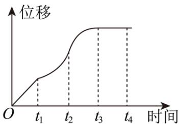

# 深圳中学 2024 级高二数学周测（1）

## 一、选择题：本题共8小题，每小题5分，共40分.在每小题给出的四个选项中，只有一个选项是正确的.

### 1. 一辆汽车在笔直的公路上行驶，位移关于时间的函数图象如图所示，给出下列四个结论：

①汽车在 $[0,t_{1}]$ 时间段内每一时刻的瞬时速度相同；

②汽车在 $[t_{1},t_{2}]$ 时间段内不断加速行驶；

③汽车在 $[t_{2},t_{3}]$ 时间段内不断减速行驶；

④汽车在 $t_{2}$ 时刻的瞬时速度小于 $t_{4}$ 时刻的瞬时速度.

其中正确结论的个数有（）
A. 1 个

B. 2 个

C. 3 个

D. 4 个

### 2. 函数 $f(x) = x^{2} - x$ 在区间[1,3]上的平均变化率为（）

A. 6

B. 3

C. 2

D. 1

### 3. 若函数 $f(x)$ 的导函数 $f'(x)$ 存在，且 $\lim_{\Delta x \to 0} \frac{f(1 - \Delta x) - f(1)}{2\Delta x} = 4$ ，则 $f'(1) = (\quad)$

A. -2

B. 2

C. -8

D. 8

### 4. 函数 $f(x)$ 的导函数 $f'(x)$ ，满足关系式 $f(x)=x^{2}+2xf'(2)-\ln x$ ，则 $f'(2)$ 的值为（）

A. $-\frac{7}{2}$

B. $\frac{7}{2}$

C. $-\frac{1}{2}$

D. $\frac{1}{2}$

### 5. 点 $P$ 在曲线 $y = x^3 - x + \frac{2}{3}$ 上，设曲线在点 $P$ 处切线的倾斜角为 $\alpha$ ，则角 $\alpha$ 的取值范围是（）

A. $\left[0, \frac{\pi}{2}\right)$

B. $\left[0, \frac{\pi}{2}\right) \cup \left(-\frac{\pi}{2}, 0\right)$

C. $\left[\frac{3\pi}{4}, \pi\right)$

D. $\left[0, \frac{\pi}{2}\right) \cup \left[\frac{3\pi}{4}, \pi\right)$

### 6. 若点 $P$ 是曲线 $y = \ln x - x^2$ 上任意一点，则点 $P$ 到直线 $l: x + y - 4 = 0$ 距离的最小值为（）

A. $\frac{\sqrt{2}}{2}$

B. $\sqrt{2}$

C. $2\sqrt{2}$

D. $4\sqrt{2}$

### 7. 函数 $y = f(x)$ 的导数 $y = f'(x)$ 仍是 $x$ 的函数，通常把导函数 $y = f'(x)$ 的导数叫做函数的二阶导数，记作 $y = f''(x)$ ，类似地，二阶导数的导数叫做三阶导数，三阶导数的导数叫做四阶导数……一般地， $n - 1$ 阶导数的导数叫做 $n$ 阶导数，函数 $y = f(x)$ 的 $n$ 阶导数记为 $y=f^{(n)}(x)$ ，例如 $y=e^{x}$ 的n阶导数 $(e^{x})^{(n)}=e^{x}$ 。若 $f(x)=xe^{x}+\cos2x$ ，则 $f^{(50)}(0)=(\quad)$

A. $50 - 2^{50}$

B. 50

C. 49

D. $49 + 2^{49}$

### 8. 已知直线 $y = kx + b$ 既是曲线 $y = \ln x$ 的切线，也是曲线 $y = -\ln (-x)$ 的切线，则（）

A. $k = \frac{1}{\mathrm{e}}, b = 0$

B. $k = 1, b = 0$

C. $k = \frac{1}{\mathrm{e}}, b = -1$

D. $k = 1, b = -1$

## 二、多选题：本题共3小题，每小题6分，共18分.在每小题给出的四个选项中，有多项符合题目要求.全部选对的得6分，部分选对的得部分分，选对但不全的得部分分，有选错的得0分.

### 9. 下列求导运算正确的是（）

A. $(\ln7)' = \frac{1}{7}$

B. $[(x^{2}+2)\sin x]' = 2x\sin x + (x^{2}+2)\cos x$

C. $\left(\frac{x^{2}}{\mathrm{e}^{x}}\right)^{\prime}=\frac{2x-x^{2}}{\mathrm{e}^{x}}$

D. $[\ln(3x+2)]'=\frac{1}{3x+2}$

### 10. 已知定义在 $R$ 上的偶函数 $f(x)$ 满足 $f(0) = 2, f(3 - x) + f(x) = 1$ ，设 $f(x)$ 在 $R$ 上的导函数为 $g(x)$ ，则（）

A. $g(2025) = 0$

B. $g\left(\frac{3}{2}\right) = \frac{1}{2}$

C. $g(x + 6) = g(x)$

D. $\sum_{n=1}^{2025} f(n) = 1011$

### 11. 已知定义在 $\mathbf{R}$ 上的函数 $f(x), g(x)$ 的导函数分别为 $f'(x), g'(x)$ ，且 $f(x) = f(4 - x)$ ， $f(1 + x) - g(x) = 4, f'(x) + g'(1 + x) = 0$ ，则（）

A. $g(x)$ 关于直线 $x = 1$ 对称

B. $g'(3) = 1$

C. $f'(x)$ 的周期为4

D. $f'(n) \cdot g'(n) = 0 (n \in Z)$

## 三、填空题：3 小题，每小题 5 分，共 15 分.

### 12. 写出一个同时具有下列性质①②③的函数 $f(x)$ : \_\_\_\_.

① $f(x_{1}x_{2})=f(x_{1})f(x_{2})$ ; ②当 $x\in(0,+\infty)$ 时， $f'(x)>0$ ; ③ $f'(x)$ 是奇函数.

### 13. 若曲线 $y = (x + a)e^{x}$ 有两条过坐标原点的切线，则 $a$ 的取值范围是 \_\_\_\_.

### 14. 已知函数 $f(x) = |e^x - 1|, x_1 < 0, x_2 > 0$ ，函数 $f(x)$ 的图象在点 $A(x_1, f(x_1))$ 和点 $B(x_2, f(x_2))$ 的两条切线互相垂直，且分别交 $y$ 轴于 $M$ ， $N$ 两点，则 $\frac{|AM|}{|BN|}$ 取值范围是 \_\_\_\_.

## 答题卡

班级\_\_\_\_ 姓名\_\_\_\_ 分数\_\_\_\_

<table><tr><td colspan="8">选择题</td><td colspan="3">多选题</td></tr><tr><td>1</td><td>2</td><td>3</td><td>4</td><td>5</td><td>6</td><td>7</td><td>8</td><td>9</td><td>10</td><td>11</td></tr><tr><td></td><td></td><td></td><td></td><td></td><td></td><td></td><td></td><td></td><td></td><td></td></tr></table>

### 12. \_\_\_\_ 13. \_\_\_\_ 14. \_\_\_\_

## 四、解答题：本题共2小题，共27分. 解答应写出必要的文字说明、证明过程或演算步骤.

### 15. 求下列函数的导数:

(1) $y = \mathrm{e}^{-x}(x + 1)^{2};$

(2) $y = \cos(3x - 1) - \ln(-2x + 1);$

(3) $y = \sin 2x + \cos ^{2} x;$

(4) $y = \frac{\sqrt{2x - 1}}{x}.$

(5) $y = e^{x}\sin x - \cos x$

$$(6) y = \tan x + \ln (- x)$$

(7) $y = x - \sin \frac{x}{2} \cos \frac{x}{2}$

(8) $y = \frac{\ln(1 - x)}{\mathrm{e}^x}$

### 16. 已知函数 $F(x) = \mathrm{e}^{x - 1} + \frac{1}{3} x$ ， $G(x) = -x + m\sin x (m \neq 0)$ .

(1)求函数 $F(x)$ 图象在x=1处的切线方程.

(2)若对于函数 $F(x)$ 图象上任意一点处的切线 $l_{1}$ ，在函数 $G(x)$ 图象上总存在一点处的切线 $l_{2}$ ，使得 $l_{1} \perp l_{2}$ ，求实数m的取值范围.
