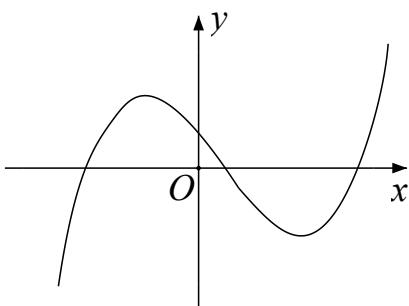
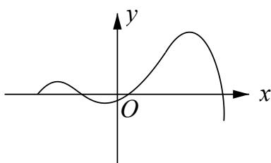
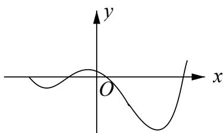
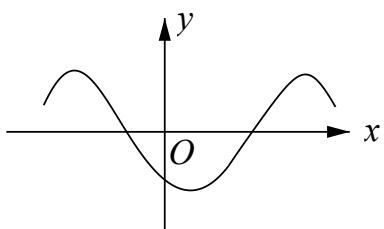
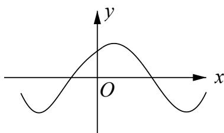

# 深圳中学 2024 级高二数学周测（3）

## 一、选择题：本题共8小题，每小题5分，共40分.在每小题给出的四个选项中，只有一个选项是正确的.

### 1. 已知函数 $f(x) = (2x + 1)\mathrm{e}^x, f'(x)$ 为 $f(x)$ 的导函数，则 $f'(0)$ 的值为

A. 1

B. 2

C. 3

D. 4

### 2. 函数 $y = f(x)$ 的导函数 $y = f'(x)$ 的图像如图所示，则函数 $y = f(x)$ 的图象可能是

A.

B.

C.

D.

### 3. 曲线 $y = 2\sin x + \cos x$ 在点 $(\pi, -1)$ 处的切线方程为

A. $x - y - \pi - 1 = 0$

B. $2x - y - 2\pi - 1 = 0$

C. $2x + y - 2\pi + 1 = 0$

D. $x + y - \pi + 1 = 0$

### 4. 设 $f(x) = x - \sin x$ ，则 $f(x) =$

A. 既是奇函数又是减函数

B. 既是奇函数又是增函数

C. 是有零点的减函数

D. 是没有零点的奇函数

### 5. 设函数 $f'(x)$ 是奇函数 $f(x) (x \in \mathbf{R})$ 的导函数， $f(-1) = 0$ ，当 $x > 0$ 时， $xf'(x) - f(x) < 0$ ，则使得 $f(x) > 0$ 成立的 $x$ 的取值范围是

A. $(-\infty, -1)\mathrm{U}(0,1)$

B. $(-1,0)\mathrm{U}(1,+\infty)$

C. $(-\infty,-1)\mathrm{U}(-1,0)$

D. $(0,1)\mathrm{U}(1,+\infty)$

### 6. 若 $a > 0, b > 0$ ，且函数 $f(x) = 4x^{3} - ax^{2} - 2bx + 2$ 在 $x = 1$ 处有极值，则 $ab$ 的最大值等于

A. 2

B. 3

C. 6

D. 9

### 7. 已知函数 $f(x) = ae^x - \ln x$ 在区间(1,2)上单调递增，则 $a$ 的最小值为

A. $e^2$

B. $e$

C. $e^{-1}$

D. $e^{-2}$

### 8. 已知 $a \in \mathbf{R}$ ，设函数 $f(x) = \begin{cases} x^2 - 2ax + 2a, & x,, 1, \\ x - a\ln x, & x > 1, \end{cases}$ 若关于 $x$ 的不等式 $f(x)$ .0 在 $\mathbf{R}$ 上恒成立，则 $a$ 的取值范围为

A. [0,1]

B. [0,2]

C. [0,e]

D. [1,e]

## 二、多选题：本题共3小题，每小题6分，共18分.在每小题给出的四个选项中，有多项符合题目要求.全部选对的得6分，部分选对的得部分分，选对但不全的得部分分，有选错的得0分.

### 9. 设函数 $f(x)$ 的定义域为 $\mathbf{R}$ ， $x_0(x_0 \neq 0)$ 是 $f(x)$ 的极大值点，以下结论一定正确的是

A. $\forall x \in \mathbf{R}, f(x) \leq f(x_0)$

B. $-x_0$ 是 $f(-x)$ 的极大值点
C. $-x_0$ 是 $-f(x)$ 的极小值点
D. $-x_0$ 是 $-f(-x)$ 的极小值点

### 10. 已知函数 $f(x) = 2^x$ ， $g(x) = x^2 + ax$ （其中 $a \in R$ ）。对于不相等的实数 $x_1, x_2$ ，设 $m = \frac{f(x_1) - f(x_2)}{x_1 - x_2}$ ， $n = \frac{g(x_1) - g(x_2)}{x_1 - x_2}$ ，则

A. 对于任意不相等的实数 $x_1, x_2$ ，都有 $m > 0$

B. 对于任意的 $a$ 及任意不相等的实数 $x_1, x_2$ ，都有 $n > 0$

C. 对于任意的 $a$ ，存在不相等的实数 $x_1, x_2$ ，使得 $m = n$

D. 对于任意的 $a$ ，存在不相等的实数 $x_1, x_2$ ，使得 $m = -n$

### 11. 设函数 $f(x) = 2x^{3} - 3ax^{2} + 1$ ，则

A. 当 $a > 1$ 时， $f(x)$ 有三个零点
B. 当 $a < 0$ 时， $x = 0$ 是 $f(x)$ 的极大值点
C. 存在 $a, b$ ，使得 $x = b$ 为曲线 $y = f(x)$ 的对称轴
D. 存在 $a$ ，使得点 $(1, f(1))$ 为曲线 $y = f(x)$ 的对称中心

## 三、填空题：3 小题，每小题 5 分，共 15 分.

### 12. 曲线 $y = \ln |x|$ 过坐标原点的两条切线的方程为 \_\_\_\_，\_\_\_\_。

### 13. 若函数 $f(x) = 2x^{3} - ax^{2} + 1 (a \in R)$ 在 $(0, +\infty)$ 内有且只有一个零点，则 $f(x)$ 在 $[-1, 1]$ 上的最大值与最小值的和为 \_\_\_\_.

### 14. 设函数 $f(x) = e^{x}(2x - 1) - ax + a$ ，其中 $a < 1$ ，若存在唯一的整数 $x_{0}$ ，使得 $f(x_{0}) < 0$ ，则 $a$ 的取值范围是 \_\_\_\_.

## 答题卡

班级\_\_\_\_ 姓名\_\_\_\_ 分数

<table><tr><td colspan="8">选择题</td><td colspan="3">多选题</td></tr><tr><td>1</td><td>2</td><td>3</td><td>4</td><td>5</td><td>6</td><td>7</td><td>8</td><td>9</td><td>10</td><td>11</td></tr><tr><td></td><td></td><td></td><td></td><td></td><td></td><td></td><td></td><td></td><td></td><td></td></tr></table>

### 12. \_\_\_\_ 13. \_\_\_\_ 14. \_\_\_\_

## 四、解答题：本题共2小题，共27分. 解答应写出必要的文字说明、证明过程或演算步骤.

### 15. 设函数 $f(x)=[ax^{2}-(4a+1)x+4a+3]e^{x}$ .

(1)若曲线 $y = f(x)$ 在点 $(1, f(1))$ 处的切线与 x 轴平行，求 a；

(2)若 $f(x)$ 在 x=2 处取得极小值，求 a 的取值范围.

### 16. 已知函数 $f(x) = \frac{1}{x} - x + a\ln x$ .

(1)讨论 $f(x)$ 的单调性;

(2)若 $f(x)$ 存在两个极值点 $x_{1}, x_{2}$ ，证明： $\frac{f(x_1) - f(x_2)}{x_1 - x_2} < a - 2$ .
