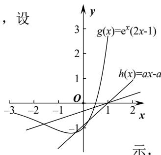

# 深圳中学 2024 级高二数学周测（3）参考答案

<table><tr><td colspan="8">选择题</td><td colspan="3">多选题</td></tr><tr><td>1</td><td>2</td><td>3</td><td>4</td><td>5</td><td>6</td><td>7</td><td>8</td><td>9</td><td>10</td><td>11</td></tr><tr><td>C</td><td>D</td><td>C</td><td>B</td><td>A</td><td>D</td><td>C</td><td>C</td><td>BD</td><td>AD</td><td>AD</td></tr></table>

填空题：12. $y = \frac{1}{\mathrm{e}} x$ ， $y = -\frac{1}{\mathrm{e}} x$ 13.-3 14. $[\frac{3}{2e},1)$

### 5. A

**详解**构造新函数 $g(x) = \frac{f(x)}{x}$ , $g'(x) = \frac{xf'(x) - f(x)}{x^2}$ ，当 $x > 0$ 时 $g'(x) < 0$ .

所以在 $(0,+\infty)$ 上 $g(x)=\frac{f(x)}{x}$ 单减，又 $f(1)=0$ ，即 $g(1)=0$ .

所以 $g(x)=\frac{f(x)}{x}>0$ 可得 0<x<1, 此时 $f(x)>0$ ,

又 $f(x)$ 为奇函数，所以 $f(x)>0$ 在 $(-∞,0)∪(0,+∞)$ 上的解集为： $(-∞,-1)∪(0,1)$ .

### 7. C

**详解**依题可知， $f'(x) = ae^{x} - \frac{1}{x} \geq 0$ 在(1,2)上恒成立，显然 $a > 0$ ，所以 $x\mathrm{e}^x \geq \frac{1}{a}$ ，

设 $g(x)=xe^{x}, x\in(1,2)$ ，所以 $g'(x)=(x+1)e^{x}>0$ ，所以 $g(x)$ 在 $(1,2)$ 上单调递增，

$g(x) > g(1) = \mathrm{e}$ ，故 $\mathrm{e} \geq \frac{1}{a}$ ，即 $a \geq \frac{1}{\mathrm{e}} = \mathrm{e}^{-1}$ ，即 $a$ 的最小值为 $\mathrm{e}^{-1}$ .

### 8. C

**详解**当 $x = 1$ 时， $f(1) = 1 - 2a + 2a = 1 > 0$ 恒成立；

当 $x < 1$ 时， $f(x) = x^2 - 2ax + 2a \geqslant 0 \Leftrightarrow 2a \geqslant \frac{x^2}{x - 1}$ 恒成立，令

$$g (x) = \frac {x ^ {2}}{x - 1} = - \frac {x ^ {2}}{1 - x} = - \frac {(1 - x - 1) ^ {2}}{1 - x} = - \frac {(1 - x) ^ {2} - 2 (1 - x) + 1}{1 - x} =$$

$-(1 - x) + \frac{1}{1 - x} - 2 \leqslant -\left(2\sqrt{(1 - x) \cdot \frac{1}{1 - x}} - 2\right) = 0$ ，所以 $2a \geqslant g(x)_{\max} = 0$ ，即 $a > 0$ 。

当 $x > 1$ 时， $f(x) = x - a \ln x \geqslant 0 \Leftrightarrow a \leqslant \frac{x}{\ln x}$ 恒成立，令 $h(x) = \frac{x}{\ln x}$ ，则 $h'(x) = \frac{\ln x - x \cdot \frac{1}{x}}{(\ln x)^2} = \frac{\ln x - 1}{(\ln x)^2}$ .

当 $x > \mathrm{e}$ 时， $h'(x) > 0$ ， $h(x)$ 递增，当 $1 < x < \mathrm{e}$ 时， $h'(x) < 0$ ， $h(x)$ 递减，

所以当 $x = \mathsf{e}$ 时， $h(x)$ 取得最小值 $h(\mathsf{e}) = \mathsf{e}$ . 所以 $a \leqslant h(x)_{\min} = \mathsf{e}$ .

综上，a 的取值范围是 $[0, e]$ .

### 10. AD

**详解**A 选项：设 $x_{1} > x_{2}$ ，函数 $2^{x}$ 单调递增，所有 $2^{x_{1}} > 2^{x_{2}}$ ， $x_{1} - x_{2} > 0$ ，

则 $m=\frac{f(x_{1})-f(x_{2})}{x_{1}-x_{2}}=\frac{2^{x_{1}}-2^{x_{2}}}{x_{1}-x_{2}}>0$ ，所以 A 选项正确；

B 选项：设 $x_{1} > x_{2}$ ，则 $x_{1} - x_{2} > 0$ ，则 $n = \frac{g(x_{1}) - g(x_{2})}{x_{1} - x_{2}} = \frac{x_{1}^{2} - x_{2}^{2} + a(x_{1} - x_{2})}{x_{1} - x_{2}}$ $= \frac{(x_1 - x_2)(x_1 + x_2 + a)}{x_1 - x_2} = x_1 + x_2 + a$ ，可令 $x_{1} = 1$ ， $x_{2} = 2$ ， $a = -4$ ，则 $n = -1 < 0$ ，所以 B 选项错误；

C 选项：因为 $m = n$ ， $\frac{f(x_1) - f(x_2)}{x_1 - x_2} = x_1 + x_2 + a$ ，分母乘到右边，

右边即为 $g(x_1) - g(x_2)$ ，所以原等式即为 $f(x_1) - f(x_2) = g(x_1) - g(x_2)$ ，

即为 $f(x_1) - g(x_2) = f(x_1) - g(x_2)$ ，令 $h(x) = f(x) - g(x)$ ，

则原题意转化为对于任意的 ℓ，函数 $h(x) = f(x) - g(x)$ 存在不相等的实数 $x_{1}$ ， $x_{2}$ 使得函数值相等， $h(x) = 2^{x} - x^{2} - ax$ ，则 $h'(x) = 2^{x} \ln 2 - 2x - a$ ，

则 $h''(x) = 2^{x} (\ln 2) - 2$ ，令 $h''(x_0) = 0$ ，且 $1 < x_0 < 2$ ，可得 $h'(x_0)$ 为极小值.

若 $a = -10000$ ，则 $h'(x_0) > 0$ ，即 $h'(x_0) > 0$ ， $h(x)$ 单调递增，不满足题意，

所以 C 选项错误.

D 选项： $f(x_1) - f(x_2) = g(x_1) - g(x_2)$ ，则 $f(x_1) + g(x_1) = g(x_2) + f(x_2)$ ，

设 $h(x) = f(x) + g(x)$ ，有 $x_{1}$ ， $x_{2}$ 使其函数值相等，则 $h(x)$ 不恒为单调. $h(x) = 2^{x} + x^{2} + ax$ ， $h'(x) = 2^{x} \ln 2 + 2x + a$ ， $h''(x) = 2^{x} (\ln 2)^{2} + 2 > 0$ 恒成立， $h'(x)$ 单调递增且 $h'(-\infty) < 0$ ， $h'(+\infty) > 0$ 。所以 $h(x)$ 先减后增，满足题意，所以 D 选项正确.

### 11. AD

**详解**A选项， $f'(x)=6x^{2}-6ax=6x(x-a)$ ，由于a>1，故 $x\in(-\infty,0)\cup(a,+\infty)$ 时 $f'(x)>0$ ，故 $f(x)$ 在 $(-∞,0),(a,+∞)$ 上单调递增， $x∈(0,a)$ 时， $f'(x)<0$ ， $f(x)$ 单调递减，则 $f(x)$ 在x=0处取到极大值，在x=a处取到极小值，由 $f(0)=1>0$ ， $f(a)=1-a^{3}<0$ ，则 $f(0)f(a)<0$ ，根据零点存在定理 $f(x)$ 在 $(0,a)$ 上有一个零点，
又 $f(-1)=-1-3a<0$ ， $f(2a)=4a^{3}+1>0$ ，则 $f(-1)f(0)<0,f(a)f(2a)<0$ ，则 $f(x)$ 在 $(-1,0),(a,2a)$ 上各有一个零点，于是a>1时， $f(x)$ 有三个零点，A选项正确；
B选项， $f'(x)=6x(x-a)$ ，a<0时， $x∈(a,0),f'(x)<0$ ， $f(x)$ 单调递减， $x∈(0,+\infty)$ 时 $f'(x)>0$ ， $f(x)$ 单调递增，此时 $f(x)$ 在x=0处取到极小值，B选项错误；
C选项，假设存在这样的a,b，使得x=b为 $f(x)$ 的对称轴，
即存在这样的a,b使得 $f(x)=f(2b-x)$ ，即 $2x^{3}-3ax^{2}+1=2(2b-x)^{3}-3a(2b-x)^{2}+1$ ，根据二项式定理，等式右边 $(2b-x)^{3}$ 展开式含有 $x^{3}$ 的项为 $2C_{3}^{3}(2b)^{0}(-x)^{3}=-2x^{3}$ ，于是等式左右两边 $x^{3}$ 的系数都不相等，原等式不可能恒成立，

于是不存在这样的 a, b，使得 x = b 为 $f(x)$ 的对称轴，C 选项错误；

## D 选项，方法一：利用对称中心的表达式化简

$f(1)=3-3a$ ，若存在这样的a，使得 $(1,3-3a)$ 为 $f(x)$ 的对称中心，则 $f(x)+f(2-x)=6-6a$ ，事实上， $f(x)+f(2-x)=2x^{3}-3ax^{2}+1+2(2-x)^{3}-3a(2-x)^{2}+1=(12-6a)x^{2}+(12a-24)x+18-12a$ 于是 $6-6a=(12-6a)x^{2}+(12a-24)x+18-12a$ 即 $\left\{\begin{aligned}&12-6a=0\\ &12a-24=0\\ &18-12a=6-6a\end{aligned}\right.$ ，解得a=2，即存在a=2使得 $(1,f(1))$ 是 $f(x)$ 的
对称中心方法二：直接利用拐点结论任何三次函数都有对称中心，对称中心的横坐标是二阶导数的零点， $f(x)=2x^{3}-3ax^{2}+1,\quad f'(x)=6x^{2}-6ax,\quad f''(x)=12x-6a$ ，由 $f''(x)=0\Leftrightarrow x=\frac{a}{2}$ ，于是该三次函数的对称中心为 $\left(\frac{a}{2},f\left(\frac{a}{2}\right)\right)$ ，由题意 $(1,f(1))$ 也是对称中心，故 $\frac{a}{2}=1\Leftrightarrow a=2$

## 13. -3**详解**[方法一]:[通性通法]单调性法

求导得 $f'(x)=6x^{2}-2ax$ ，当 $a\leq0$ 时，函数 $f(x)$ 在区间 $(0,+\infty)$ 内单调递增，且 $f(x)>f(0)=1$ ，所以函数 $f(x)$ 在 $(0,+\infty)$ 内无零点；当 a>0 时，函数 $f(x)$ 在区间 $\left(0,\frac{a}{3}\right)$ 内单调递减，在区间 $\left(\frac{a}{3},+\infty\right)$ 内单调递增。
当 x=0 时， $f(0)=1$ ；当 $x\to+\infty$ 时， $f(x)\to+\infty$ .
要使函数 $f(x)$ 在区间 $(0,+\infty)$ 内有且仅有一个零点，只需 $f\left(\frac{a}{3}\right)=0$ ，解得 a=3。于是函数 $f(x)$ 在区间 $[-1,0]$ 上单调递增，在区间 $(0,1]$ 上单调递减， $[f(x)]_{\max}=f(0)=1,[f(x)]_{\min}=f(-1)=-4$ ，所以最大值与最小值之和为 -3。

## [方法二]: 等价转化

由条件知 $2x^{3} + 1 = ax^{2}$ 有唯一的正实根，于是 $a = \frac{2x^3 + 1}{x^2} = 2x + \frac{1}{x^2}$ 。令 $g(x) = 2x + \frac{1}{x^2}, x > 0$ ，则 $g'(x) = 2 - \frac{2}{x^3} = \frac{2(x^3 - 1)}{x^3}$ ，所以 $g(x)$ 在区间 $(0,1)$ 内单调递减，在区间 $(1, +\infty)$ 内单调递增，且 $g(1) = 3$ ，当 $x \to 0$ 时， $g(x) \to +\infty$ ；当 $x \to +\infty$ 时， $g(x) \to +\infty$ 。只需直线 $y = a$ 与 $g(x)$ 的图像有一个交点，故 $a = 3$ ，下同方法一。

### 14. $[\frac{3}{2e}, 1)$ 

**详解**由题意可知存在唯一的整数 $x_0$ ，使得 $e^{x_0}(2x_0 - 1) < ax_0 - a$ ，设

$g(x)=e^{x}(2x-1)$ ， $h(x)=ax-a$ ，由 $g'(x)=e^{x}(2x+1)$ ，可知 $g(x)$ 在 $(-∞,-\frac{1}{2})$

上单调递减，在 $(- \frac{1}{2}, +\infty)$ 上单调递增，作出 $g(x)$ 与 $h(x)$ 的大致图象如图所

故 $\left\{\begin{aligned}h(0)>g(0)\\h(-1)\leqslant g(-1)\end{aligned}\right.$ ，即 $\left\{\begin{aligned}a<1\\-2a\leqslant-\frac{3}{e}\end{aligned}\right.$ ，所以 $\frac{3}{2e}\leqslant a<1$ .

### 15. 

**详解**(1)因为 $f(x) = [ax^2 - (4a + 1)x + 4a + 3]e^x$ ，

所以 $f'(x)=[2ax-(4a+1)]e^{x}+[ax^{2}-(4a+1)x+4a+3]e^{x}\quad(x\in\mathbf{R})$ $=[ax^{2}-(2a+1)x+2]e^{x}$ . $f'(1)=(1-a)e$ . 由题设知 $f'(1)=0$ ，即 $(1-a)e=0$ ，解得 a=1.

此时 $f(1)=3e\neq0$ . 所以 a 的值为 1.

(2)由(1)得 $f'(x)=[ax^{2}-(2a+1)x+2]e^{x}=(ax-1)(x-2)e^{x}$ .

若 $a > \frac{1}{2}$ ，则当 $x \in (\frac{1}{a}, 2)$ 时， $f'(x) < 0$ ；当 $x \in (2, +\infty)$ 时， $f'(x) > 0$ 。所以 $f(x) < 0$ 在 $x = 2$ 处取得极小值。若 $a \leqslant \frac{1}{2}$ ，则当 $x \in (0, 2)$ 时， $x - 2 < 0$ ， $ax - 1 \leqslant \frac{1}{2} x - 1 < 0$ ，所以 $f'(x) > 0$ 。所以 2 不是 $f(x)$ 的极小值点。综上可知， $a$ 的取值范围是 $(\frac{1}{2}, +\infty)$ 。

### 16. 

**详解**(1) $f(x)$ 的定义域为 $(0,+\infty)$ ， $f'(x)=-\frac{1}{x^{2}}-1+\frac{a}{x}=-\frac{x^{2}-ax+1}{x^{2}}$ .

（i）若 $a \leqslant 2$ ，则 $f'(x) \leqslant 0$ ，当且仅当 $a = 2$ ， $x = 1$ 时 $f'(x) = 0$ ，所以 $f(x)$ 在 $(0, +\infty)$ 单调递减.

（ii）若 $a > 2$ ，令 $f^{\prime}(x) = 0$ 得， $x = \frac{a - \sqrt{a^2 - 4}}{2}$ 或 $x = \frac{a + \sqrt{a^2 - 4}}{2}$

当 $x \in (0, \frac{a - \sqrt{a^2 - 4}}{2}) \cup (\frac{a + \sqrt{a^2 - 4}}{2}, +\infty)$ 时， $f'(x) < 0$ ；

当 $x \in (\frac{a - \sqrt{a^2 - 4}}{2}, \frac{a + \sqrt{a^2 - 4}}{2})$ 时， $f'(x) > 0$ 。所以 $f(x)$ 在 $(0, \frac{a - \sqrt{a^2 - 4}}{2})$ ， $(\frac{a + \sqrt{a^2 - 4}}{2}, +\infty)$ 单调递减，在 $(\frac{a - \sqrt{a^2 - 4}}{2}, \frac{a + \sqrt{a^2 - 4}}{2})$ 单调递增。

(2)由(1)知， $f(x)$ 存在两个极值点当且仅当a>2.

由于 $f(x)$ 的两个极值点 $x_{1}$ ， $x_{2}$ 满足 $x^{2} - ax + 1 = 0$ ，所以 $x_{1}x_{2} = 1$ ，不妨设 $x_{1} < x_{2}$ ，则 $x_{2} > 1$ 。由于 $\frac{f(x_1) - f(x_2)}{x_1 - x_2} = -\frac{1}{x_1x_2} - 1 + a\frac{\ln x_1 - \ln x_2}{x_1 - x_2} = -2 + a\frac{\ln x_1 - \ln x_2}{x_1 - x_2} = -2 + a\frac{-2\ln x_2}{\frac{1}{x_2} - x_2}$ ，

所以 $\frac{f(x_1) - f(x_2)}{x_1 - x_2} < a - 2$ 等价于 $\frac{1}{x_2} - x_2 + 2\ln x_2 < 0$ 。设函数 $g(x) = \frac{1}{x} - x + 2\ln x$ ，由(1)知， $g(x)$ 在 $(0, +\infty)$ 单调递减，又 $g(1) = 0$ ，从而当 $x \in (1, +\infty)$ 时， $g(x) < 0$ 。所以 $\frac{1}{x_2} - x_2 + 2\ln x_2 < 0$ ，得证
