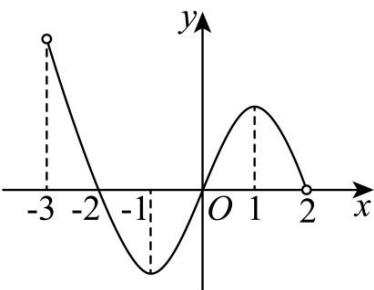

# 深圳中学 2024 级高二数学周测（4）

## 一、选择题：本题共8小题，每小题5分，共40分.在每小题给出的四个选项中，只有一个选项是正确的.

### 1. 若 $f(x) = \frac{1}{1 + 2x}$ ，则 $f(x)$ 在 $x = 0$ 处的瞬时变化率为（）

A. 1

B. -1

C. 2

D. -2

### 2. 设函数 $f(x) = \frac{1}{x^2} + 1$ ，则 $\lim_{\Delta x \to 0} \frac{f(1 - 3\Delta x) - f(1)}{\Delta x} = (\quad)$

A. 3

B. $\frac{3}{2}$

C. 6

D. 0

### 3. 直线 $x + y - 1 = 0$ 是曲线 $y = \ln x - 2x + a$ 的一条切线，则 $a = (\quad)$

A. -2

B. -1

C. 1

D. 2

### 4. 已知函数 $f(x) = x(x - a)^2$ 在 $x = 1$ 处取得极大值，则 $a = (\quad)$

A. 3或1

B. 3

C. 2

D. 1

### 5. 若 $f(x)$ 是定义在区间 $(-3,2)$ 上的函数，其图象如图所示，设 $f(x)$ 的导函数为 $f'(x)$ ，则 $\frac{f'(x)}{f(x)}>0$ 的解集为（）

A. $(-2,-1)\cup(1,2)$

B. $(-1,0)\cup(1,2)$

C. $(-2,-1)\cup(0,1)$

D. $(-3,-2)\cup(0,1)$

### 6. 若函数 $f(x) = \frac{1}{2} x + \cos x$ 在 $x \in [0, a]$ 上存在唯一的极大值点，则实数 $a$ 的取值范围为（）

A. $\left(\frac{\pi}{6}, \frac{13\pi}{6}\right]$

B. $\left[\frac{\pi}{6}, \frac{13\pi}{6}\right)$

C. $\left(\frac{13\pi}{6}, \frac{17\pi}{6}\right)$

D. $\left[\frac{13\pi}{6}, \frac{17\pi}{6}\right]$

### 7. 若函数 $f(x) = -x^2 + ax + 4\ln x$ 在(1,2)上有最大值，则实数 $a$ 的取值范围为（）

A. $(-2, +\infty)$

B. $(-2, 2)$

C. $(- \infty, 2)$

D. $(0, 2)$

### 8. 已知 $a = \frac{\ln 4}{4}, b = \frac{1}{\mathrm{e}}, c = \frac{2}{3} \ln \frac{3}{2}$ ，则 $a, b, c$ 的大小关系为（）

A. $a > b > c$

B. $b > a > c$

C. $a > c > b$

D. $b > c > a$

## 二、多选题：本题共3小题，每小题6分，共18分.在每小题给出的四个选项中，有多项符合题目要求.全部选对的得6分，部分选对的得部分分，选对但不全的得部分分，有选错的得0分.

### 9. 已知函数 $f(x) = \mathrm{e}^{x} - \mathrm{e}^{-x} - 2\cos x$ ，则（）

A. $f(0) = -2$

B. $f^{\prime}(x) = \mathrm{e}^{x} + \mathrm{e}^{-x} - 2\sin x$

C. $f(x)$ 在 $\mathbf{R}$ 上单调递增

D. 不等式 $f(x) + 2 > 0$ 的解集为 $(0, + \infty)$

### 10. 已知 $a \in \mathbf{R}$ ，函数 $f(x) = ax^3 + 2x + 1$ 有两个极值点 $x_1, x_2$ ，则（）

A. $a$ 是负数
B. $x_1 + x_2 \neq 0$

C. 函数 $f(x)$ 图象的对称中心为 $(0,1)$

D. 曲线 $y = f(x)$ 在点 $(0, f(0))$ 处的切线方程为 $y = 2x + 1$

### 11. 对于函数 $f(x) = \frac{x}{\ln x}$ ，下列说法正确的是（）

A. $f(x)$ 在 $(0, e)$ 上单调递减，在 $(e, +\infty)$ 上单调递增

B. $f(\pi) < f(2)$

C. 设 $g(x) = |f(x)| - 2k + 1$ 有3个不同的零点，则 $k > \frac{e+1}{2}$

D. 若方程 $|f(|x|)| = k$ 有6个不等实数根，则 $k > e$

## 三、填空题：3 小题，每小题 5 分，共 15 分.

### 12. 已知函数 $f(x)$ , $g(x)$ 满足: $f(x) + x^{2}g(x) = e^{x} - x$ ，且 $f(1) = 1$ ，则 $f'(1) + g'(1) =$ \_\_\_\_.

### 13. 已知函数 $f(x) = (a - x)\ln x + x - 1$ ，若 $\forall x_1, x_2 \in (0, +\infty), x_1 \neq x_2$ ，都有 $\frac{f(x_1) - f(x_2)}{x_1 - x_2} < a$ ，则 $a =$ \_\_\_\_.

### 14. 已知函数 $f(x) = x^{3} + x - \sin x$ ，则关于 t 的不等式 $f(t^{2} - t) + f(-t) < f(0)$ 的解集为 \_\_\_\_.

## 答题卡

班级\_\_\_\_ 姓名\_\_\_\_ 分数\_\_\_\_

<table><tr><td colspan="8">选择题</td><td colspan="3">多选题</td></tr><tr><td>1</td><td>2</td><td>3</td><td>4</td><td>5</td><td>6</td><td>7</td><td>8</td><td>9</td><td>10</td><td>11</td></tr><tr><td></td><td></td><td></td><td></td><td></td><td></td><td></td><td></td><td></td><td></td><td></td></tr></table>

### 12. \_\_\_\_ 13. \_\_\_\_ 14. \_\_\_\_

## 四、解答题：本题共2小题，共27分. 解答应写出必要的文字说明、证明过程或演算步骤.

### 15. 已知函数 $f(x) = a^2 x^2 - 3ax \ln x, a > 0$

(1)当 $a = 1$ 时，求曲线 $y = f(x)$ 在 $\left(1, f(1)\right)$ 处的切线方程；

(2)讨论 $f(x)$ 的零点个数.

### 16. 已知函数 $f(x) = \mathrm{e}^{x}, g(x) = \frac{a}{x}, h(x) = f(x) - g(x), a \neq 0$ .

(1)当 $a = \mathsf{e}$ 时，求曲线 $y = h(x)$ 在点 $(1,h(1))$ 处的切线方程；

(2)若当 $x < 0$ 时， $h(x) < 0$ ，求 $a$ 的取值范围；

(3)若存在两个不同的正数 $m, n$ ，使得 $f(m) = g(n)$ ，且 $f(n) = g(m)$ ，求 $a$ 的取值范围.
