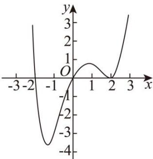

# 深圳中学 2024 级高二数学周测（7）

## 一、选择题：本题共8小题，每小题5分，共40分.在每小题给出的四个选项中，只有一个选项是正确的.

### 1. 下列求导结果正确的是（）

A. $(\sin3)'=\cos3$

B. $(\cos x)'=\sin x$

C. $\left(\frac{\mathrm{e}^{x}}{x}\right)^{\prime}=\frac{\mathrm{e}^{x}(x-1)}{x^{2}}$

D. $(\ln 2x)'=\frac{1}{2x}$

### 2. 某地的中学生中有 $60 \%$ 的同学爱好滑冰, $50 \%$ 的同学爱好滑雪, $70 \%$ 的同学爱好滑冰或爱好滑雪.在该地的中学生中随机调查一位同学, 若该同学爱好滑雪, 则该同学也爱好滑冰的概率为 ( )

A. 0.8

B. 0.6

C. 0.5

D. 0.4

### 3. 当 $x = 1$ 时，函数 $f(x) = a\ln x + \frac{b}{x}$ 取得最大值-2，则 $f^{\prime}(2) = (\quad)$

A. -1

B. $-\frac{1}{2}$

C. $\frac{1}{2}$

D. 1

### 4. 已知函数 $f(x)$ 的定义域为 $\mathbf{R}$ ，且 $f(x)$ 的图象是一条连续不断的曲线， $f(x)$ 的导函数为

$f'(x)$ ，若函数 $g(x)=(x+2)f'(x)$ 的图象如图所示，则（）
A. 2 是 $f(x)$ 的极值点
B. $f(x)$ 的单调递增区间是 $(-1,1)$ ， $(2,+\infty)$

C. $f(x)$ 的单调递减区间是 $(-\infty,0)$

D. 当 x=1 时， $f'(x)<0$

### 5. 若经过点 $(0, -2)$ 的直线 l 与曲线 $y = \ln x$ 相切，也与曲线 $y = e^{x} - a (a \in \mathbb{R})$ 相切，则 $a = (\quad)$

A. $\frac{3}{2}$

B. 1

C. 2

D. e

### 6. 定义在 $\mathbf{R}$ 上的函数 $f(x)$ 的导函数为 $f'(x)$ ，若对任意实数 $x$ ，有 $f(x) > f'(x)$ ，且 $f(x) + 2026$ 为奇函数，则不等式 $f(x) + 2026\mathrm{e}^x < 0$ 的解集是（）

A. $(- \infty, 0)$

B. $(- \infty, \ln 2026)$

C. $(0, +\infty)$

D. $(2026, +\infty)$

### 7. 设 $a \neq 0$ ，若 $a$ 为函数 $f(x) = a(x - a)^2(x - b)$ 的极大值点，则（）

A. $a < b$

B. $a > b$

C. $ab < a^2$

D. $ab > a^2$

### 8. 已知函数 $f(x) = \mathrm{e}^x - \mathrm{e}^{-x} - \sin 2x$ ，若对 $\forall x \in [2, +\infty)$ ， $f(\ln x) + f(-ax) < 0$ ，则实数 $a$ 的取值范围是（）

A. $\left(-\infty, \frac{\ln 2}{2}\right)$

B. $\left(-\infty, \frac{1}{\mathrm{e}}\right)$

C. $\left(\frac{\ln 2}{2}, +\infty\right)$

D. $\left(\frac{1}{\mathrm{e}}, +\infty\right)$

## 二、多选题：本题共3小题，每小题6分，共18分.在每小题给出的四个选项中，有多项符合题目要求.全部选对的得6分，部分选对的得部分分，选对但不全的得部分分，有选错的得0分.

### 9. 已知 $\overline{A}$ , $\overline{B}$ 分别为随机事件 $A$ , $B$ 的对立事件, 若 $P(A) = \frac{1}{6}$ , $P(B) = \frac{1}{2}$ , $P(A|B) = \frac{1}{3}$ , 则下列选项正确的是 ( ).

A. $P(AB) = \frac{1}{6}$

B. $P(B|A) = \frac{5}{6}$

C. $P(\overline{A}|B) = \frac{2}{3}$

D. $P(A + B) = \frac{1}{3}$

### 10. 若将一边长为4的正方形铁片的四角截去四个边长均为x的小正方形，然后做成一个无盖的方盒，则下列说法正确的是（）

A. 当 $x=\frac{2}{3}$ 时，方盒的容积最大
B. 方盒的容积没有最小值
C. 方盒容积的最大值为 $\frac{128}{27}$

D. 方盒容积的最大值为 $\frac{64}{27}$

### 11. 设函数 $f(x) = m\ln x - x$ , $g(x) = -\frac{1}{3}x^3 + x + a$ ，则下列结论正确的是（）

A. 当 $m = 1$ 时， $f(x)$ 在点 $(1, f(1))$ 处的切线方程为 $y = -1$

B. 当 $-1 < a < 1$ 时， $g(x)$ 有三个零点

C. 若 $F(x) = f(x) - g'(x)$ 有两个极值点，则 $0 < m < \frac{1}{8}$

D. 若 $f(mx) \geq e^x - mx$ 在 $(0, +\infty)$ 上有解，则正实数 $m$ 的取值范围为 $[e, +\infty)$

## 三、填空题：3 小题，每小题 5 分，共 15 分.

### 12. 湘绣, 是中国优秀的民族传统工艺之一, 有着两千多年的历史. 湘绣的制作工艺繁杂, 只有设计图案通过后才能进行刺绣. 某绣坊准备制作 $A, B, C$ 三幅不同的湘绣作品, 已知 $A, B, C$ 三幅作品通过设计图案环节的概率依次为 $\frac{3}{4}, \frac{2}{3}, \frac{4}{5}$ . $A, B, C$ 三幅中恰有一幅作品通过设计图案环节的概率为 \_\_\_\_.

### 13. 已知函数 $f(x) = (x - a)\ln x$ 在区间[1,2]上存在单调递减区间，则 $a$ 的取值范围为 \_\_\_\_.

### 14. 已知函数 $f(x)=\left\{\begin{aligned}-x^{2}-2x,x&\leq0\\ \ln x,x&>0\end{aligned}\right.$ ，函数 $g(x)=f(x)-a$ 有三个零点 $x_{1},x_{2},x_{3}$ ，则 $x_{1}\cdot x_{2}\cdot x_{3}$ 的取值范围为 \_\_\_\_.

## 答题卡

班级\_\_\_\_ 姓名\_\_\_\_ 分数\_\_\_\_

<table><tr><td colspan="8">选择题</td><td colspan="3">多选题</td></tr><tr><td>1</td><td>2</td><td>3</td><td>4</td><td>5</td><td>6</td><td>7</td><td>8</td><td>9</td><td>10</td><td>11</td></tr><tr><td></td><td></td><td></td><td></td><td></td><td></td><td></td><td></td><td></td><td></td><td></td></tr></table>

### 12. \_\_\_\_ 13. \_\_\_\_ 14. \_\_\_\_

## 四、解答题：本题共2小题，共27分. 解答应写出必要的文字说明、证明过程或演算步骤.

### 15. 已知函数 $f(x) = \frac{x^2}{2} - a\ln x - (a - 1)x - \frac{a}{2}$ .

(1)当a=-1时，求曲线 $y=f(x)$ 在点 $(1,f(1))$ 处的切线方程；

(2)讨论 $f(x)$ 的单调性;

(3)若 $f(x)$ 有极小值，且 $f(x)\geq0$ ，求a的取值范围.

### 16. 已知函数 $g(x)=\mathrm{e}^{x}-2a(x-1)$ ，e 为自然对数的底数.

(1)若函数 $g(x)$ 在 $(1,+\infty)$ 上有零点，求 a 的取值范围；

(2)当 $a > 0$ ， $x_{1}\neq x_{2}$ ，且 $g(x_{1}) = g(x_{2})$ ，求证： $x_{1} + x_{2} <   2\ln (2a)$
