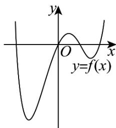
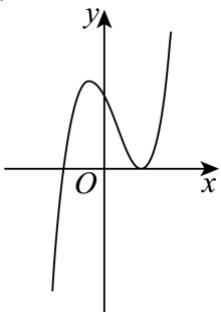
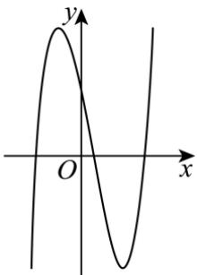
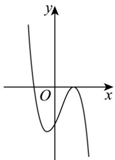
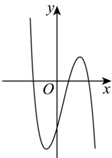
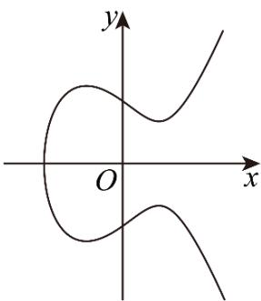

# 深圳中学 2024 级高二数学周测（5）

命题人：赵志伟

## 一、单选题

### 1. 已知 $f'(x)$ 是函数 $f(x)$ 的导函数，且 $f(x) = 2f'(1)\ln x + \frac{1}{x}$ ，则 $f'(1) = (\quad)$

A. 1

B. 2

C. -1

D. -2

### 2. 已知函数 $f(x) = \cos x + ax$ 在 $\mathbf{R}$ 上单调递增，则实数 $a$ 的取值范围是（）

A. $(- \infty, 0]$

B. $[0,1]$

C. $[1, +\infty)$

D. $\mathbf{R}$

### 3. 曲线 $y = x \ln x$ 在 $x = 1$ 处的切线与两坐标轴所围成的三角形的面积为（）

A. 4

B. 3

C. 1

D. $\frac{1}{2}$

### 4. 设 $x \in \mathbb{R}$ ，则“ $x - \sin x < 0$ ”是“ $x < 0$ ”的（）

A. 充分不必要条件

B. 必要不充分条件
C. 充要条件

D. 既不充分也不必要条件

### 5. 已知函数 $f(x)$ 在定义域内可导， $f(x)$ 的大致图象如图所示，则其导函数 $f'(x)$ 的大致图象可能为（）

A.

B.

C.

D.

### 6. 已知函数 $f(x) = \ln (\mathrm{e}^{2x} + 1) - x$ ，若 $x \in [1,2]$ 时，关于 $x$ 的不等式 $f(2x + 1) < f(x + a)$ 恒成立，则实数 $a$ 的取值范围为（）

A. $(-7, -4) \cup (2,3)$

B. $(-7, -3) \cup (2,4)$

C. $(- \infty, -7) \cup (3, +\infty)$

D. $(- \infty, -4) \cup (2, +\infty)$

### 7. 已知定义域为R的函数 $f(x)$ ，其导函数为 $f'(x)$ ，且 $f'(x) + 2f(x) < 0, f(0) = 1$ ，则（）

A. $f(-1) < e^2$

B. $f(1) < \frac{1}{e^2}$

C. $f\left(\frac{1}{2}\right) > \frac{1}{e}$

D. $ef(1) > f\left(\frac{1}{2}\right)$

### 8. 已知函数 $f(x) = a\mathrm{e}^x - x^2 + 3$ 有三个不同的零点，则实数 $a$ 的取值范围是（）

A. $\left(0, \frac{6}{\mathrm{e}^3}\right)$

B. $\left(0, \frac{2}{\mathrm{e}}\right)$

C. $\left(-2\mathrm{e}, \frac{6}{\mathrm{e}^3}\right)$

D. $\left(-2\mathrm{e}, \frac{2}{\mathrm{e}}\right)$

## 二、多选题

### 9. 下列求导数运算中不正确的是（）

A. $(4)' = 2$

B. $(\ln x)' = \frac{1}{x \ln 10}$

C. $(3^{x})' = x \cdot 3^{x-1}$

D. $(x^{5})' = 5x^{4}$

### 10. 设计一个实用的门把手, 其造型可以看作图中的曲线 $C: y^{2} = x^{3} - 2x + 2$ 的一

A. 点 $(1,1)$ 在 $C$ 上
B. 将 $C$ 在 $x$ 轴上方的部分看作函数 $f(x)$ 的图象, 则 1 是 $f(x)$ 的极小值点
C. $C$ 在点 $(1,1)$ 处的切线与 $C$ 的另一个交点的横、纵坐标均为有理数
D. $x < 0$ 时, 曲线 $C$ 上任意一点到坐标原点 $O$ 的距离均大于 $\sqrt{2}$

### 11. 已知函数 $f(x) = \sin 2x - 2\sin x$ ，则（）

A. $f(x)$ 的最小正周期为 $2\pi$

B. 曲线 $y = f(x)$ 关于直线 $x = \frac{\pi}{2}$ 对称
C. $f(x)$ 在区间 $[-2\pi, 2\pi]$ 上有 4 个零点
D. $f(x)$ 在区间 $\left(\frac{\pi}{3}, \frac{2\pi}{3}\right)$ 内单调递减

## 三、填空题

### 12. 函数 $y=\frac{1}{2}x^{2}-\ln x$ 的单调递减区间为 \_\_\_\_.

### 13. 若函数 $f(x) = x + \frac{4}{x} + 3\ln x$ 在 $(a, 2 - 3a)$ 内有最小值，则实数 $a$ 的取值范围是 \_\_\_\_.

### 14. 已知函数 $f(x) = \begin{cases} 6\ln x, & x > 0, \\ mx^2 + 6x, & x < 0. \end{cases}$ 若关于 $a$ 的方程 $f(a) = f(-a)$ 恰有四个不同的解，则正数 $m$ 的取值范围为 \_\_\_\_.

## 四、解答题

### 15. （1）证明： $\forall x\in \mathbb{R}$ ， $\mathrm{e}^x\geq \mathrm{ex}$

（2）已知函数 $f(x)=\left(x^{2}+ax+4\right)e^{x}$ （ $x\in R,\quad a\in R,\quad e$ 为自然对数的底数）.

（I）当a=4时，求函数 $f(x)$ 的单调区间；

（II）若函数 $y = -f(x)$ 在[1,3]上单调递增，求实数 $a$ 的取值范围.

### 16. 已知函数 $f(x) = x - 2 + a\ln \frac{1}{x} (a \in \mathbf{R})$ .

（1）若 $f(x)\geq -1$ ，求 $\pmb{a}$ 的值；

（2）设 $n\in \mathbf{N}^*$ ，求证： $\frac{1}{3} +\frac{1}{4} +\mathrm{L} + \frac{1}{n + 2} <  \frac{1}{2}\ln \frac{(n + 1)(n + 2)}{2}.$

### 17. 已知函数 $f(x)$ 的定义域为 $(0, +\infty)$ ，其导函数 $f'(x) = 2x + \frac{2}{x} - 2a (a \in \mathbf{R}), f(1) = 1 - 2a$ .

（1）求曲线 $y = f(x)$ 在点 $(1, f(1))$ 处的切线 l 的方程，并判断 l 是否经过一个定点；

（2）若 $\exists x_{1},x_{2}$ ，满足 $0 <   x_{1} <   x_{2}$ ，且 $f^{\prime}(x_1) = f^{\prime}(x_{2}) = 0$ ，求 $2f(x_{1}) - f(x_{2})$ 的取值范围.

### 18. 已知函数 $f(x) = \frac{\ln x + a}{x}, a \in \mathbf{R}$ .

（1）求函数 $f(x)$ 在区间[1,2]上的最大值；

（2）当 $a = 1$ 时，若 $\mathrm{e}^x\geq f(x) + m$ 恒成立，求实数 $m$ 的取值范围.

### 19. 设函数 $f(x) = \ln x + \frac{1 - a}{x} (a \in \mathbf{R})$ .

（1）若 $f(x) \geq 0$ 恒成立，求 a 的取值范围；

(2) 若 $f(x)$ 有两个零点 $x_{1}, x_{2}$ ，证明： $x_{1} + x_{2} > 2 - 2a$ .
